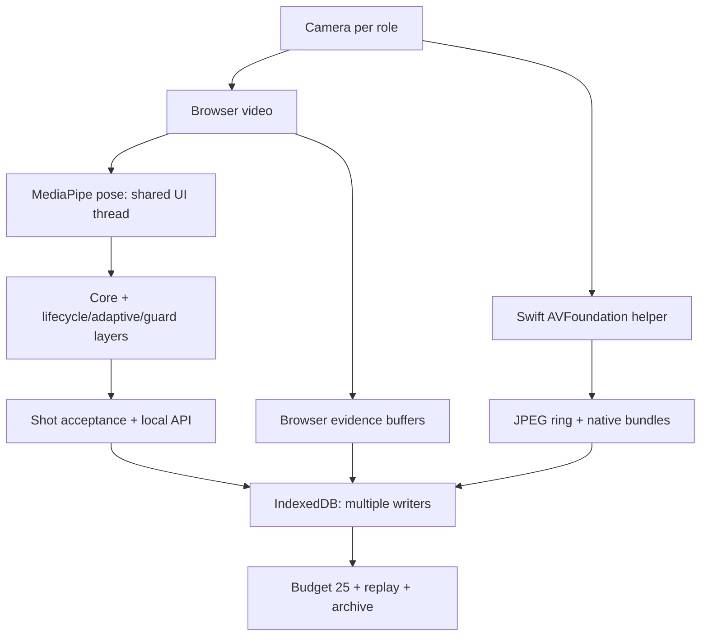
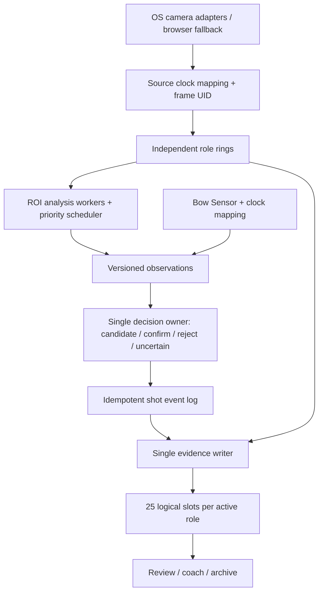

# 3PM Analyzer — Architecture Audit และ 3 ทางเลือก
วันที่ 1 ตุลาคม 2026 · สถานะ: ข้อเสนอเพื่อพิจารณา ยังไม่แก้ application code

## ข้อสรุป
แนะนำ **Option 2: Major Refactor เฉพาะเส้นทาง Capture → Clock → Frame identity → Analysis → Shot decision → Evidence persistence/review** โดยย้ายทีละส่วนและมีทางย้อนกลับ ไม่แนะนำเพิ่ม patch ครอบของเดิมต่อไปเป็นแนวทางระยะยาว และยังไม่มีเหตุผลเพียงพอให้เขียนทั้งแอปใหม่

สิ่งที่เป็นปัญหาร่วมคือข้อมูลเดียวกันผ่านหลาย clock, หลายตัวแก้ phase และหลายตัวเขียน evidence โดยไม่มีเจ้าของกลางตลอดเส้นทาง การแก้ปลายทางหนึ่งจึงเสี่ยงให้ตัวอื่นเขียนทับหรือแปลความหมายต่างกัน การมีไฟล์ชื่อ timeline หรือ test ผ่าน ยังไม่พิสูจน์ว่า production pipeline ใช้ contract นั้นครบแล้ว

รายงานนี้ไม่ได้ยืนยันว่า false capture ทุกกรณีเกิดจากสาเหตุเดียว และไม่ได้ยืนยันว่าแก้ release/let-down แล้ว ต้องใช้วิดีโอและ ground truth จากการยิงจริงแยกจาก elastic band เพื่อพิสูจน์ต่อ

## ขอบเขตและระดับหลักฐาน
Baseline คือ ZIP `3PM_Analyzer_Mac_20261001_R6_HV3_ThreeCameraFoundation(1).zip` ที่ให้มาเท่านั้น ไม่รวมการแก้จาก branch/build อื่น อ่านข้อกำหนด Pasted text และ AGENTS ของชุดนี้ ตรวจ source ของ capture, timeline, inference, lifecycle, evidence, archive และการเชื่อม UI/adapter พร้อม tests ที่เกี่ยวข้อง

ใน ZIP มี executable backend แต่ไม่พบ Go source/go.mod จึงตรวจ implementation ฝั่ง backend, transaction และ reproducible build ได้ไม่ครบ ไม่ได้ถือว่าอ่าน backend source ที่ไม่มีมา หรือ audit vendor/model internals ครบทุกบรรทัด

| การตรวจ | ผล / ขอบเขต |
|---|---|
| JavaScript regression/stress เดิม | 99/99 ผ่าน รวม synthetic cases เดิม ไม่เท่ากับ live-bow acceptance |
| Static integrity | ผ่าน frozen JavaScript และ runtime binary hashes |
| C++ shared ring test | compile/run สำเร็จบน Linux ไม่ใช่ Windows Media Foundation runtime test |
| Audit probes เพิ่มเติม | พบ null identity collapse, high-FPS dedup loss, null clock และ DOM feedback loop ตามรายละเอียดด้านล่าง |
| Distribution contract บนโฟลเดอร์แตก ZIP | หยุดที่ launcher executable bit; ตรวจ ZIP พบต้นฉบับเก็บ mode 0775 จึงเป็นข้อจำกัดการแตกไฟล์ครั้งนี้ ไม่ใช่หลักฐานว่า ZIP launcher เสีย และไม่ได้อ้างว่า gate ทั้งชุดผ่าน |
| ความคงเดิม | เทียบเนื้อหาไฟล์จาก ZIP 214 ไฟล์กับ inspection copy: ต่างกัน 0 ไฟล์ |
| กล้องจริง / macOS runtime / Windows runtime / นักยิงจริง | ไม่ได้ทดสอบในรอบ audit นี้ |

SHA-256 ZIP: `1bc31b86216222c5691b3d7bd1e649d1294595b17e67260ec72e9ff15082ffcd`

## A. Architecture ปัจจุบัน

- Desktop/local executable ให้บริการ HTML/JS; ไม่มีหลักฐานให้เสนอเปลี่ยน shell เป็น Electron/Tauri/Qt ในตอนนี้
- Browser pose เป็น production authority; Apple Vision เป็น shadow เท่านั้น ควรรักษาขอบเขตนี้จนมี benchmark ที่เทียบภาพเดียวกัน
- Side เป็น authority ปัจจุบัน; Overhead/Rear เสริมหลักฐานได้ แต่ยังไม่ควรกล่าวว่าไม่มี Side แล้ว auto-shot ทำงานเทียบเท่า
- Swift มี capture/encode queues และ time-window ring แยก role อยู่แล้ว เป็นส่วนที่ควรเก็บแนวคิดและทดสอบต่อ
- HV3 มี shared timeline core และ protocol แต่ production phase ยังใช้ epoch หลัง inference และ Windows adapter ยังเป็น boundary/stub
- Evidence อยู่ทั้ง backend API, IndexedDB และ metadata ฝั่ง browser; ไม่มีหลักฐานจาก source ที่มีว่าทั้งหมด commit แบบ atomic ข้ามระบบ
- Engine มี candidate/post-validation/let-down และหลาย cue อยู่แล้ว ปัญหาไม่ได้แก้ด้วยการเพิ่มชื่อ Candidate → Confirm เข้าไปอีกชั้น ต้องรวมความหมายและอำนาจตัดสินให้เป็นระบบเดียว

## B. Findings และแผนที่สาเหตุ
P0 = ต้องจัดการก่อนขยาย authority/release ใหม่, P1 = ต้องแก้ใน migration ก่อนประกาศรองรับเป้าหมาย ส่วนที่ระบุว่าเสี่ยงยังไม่ใช่ field failure ที่พิสูจน์แล้ว

### F01 — P0: ตัวแสดง 25 ช่องสร้าง DOM feedback loop — พิสูจน์ได้ใน isolated browser
`app/static/evidence_integrity_repair_layer.js` ฟังก์ชัน `boot`, `refresh`, `renderRail`: MutationObserver เฝ้า subtree เดียวกับที่ renderRail ล้างและเพิ่มปุ่มใหม่ทุกครั้ง จากนั้น observer เรียก refresh อีก ทำซ้ำโดยไม่มี state-change guard

นำ script จริงมารันใน Chromium กับ replay panel ขั้นต่ำ ไม่ต้องกดอะไร observer ถูกเรียกถึง 100 ครั้งแล้ว harness จึง disconnect เพื่อหยุดการทดสอบ การทดสอบปิด periodic timer เพื่อแยกสาเหตุ เป็นหลักฐานของ self-trigger ไม่ใช่การวัดว่าเครื่องผู้ใช้ค้างนานเท่าใด

ผลที่เป็นไปได้: แย่ง UI/main-thread/inference และทำให้การตรวจอาการเวลาไม่เสถียร แนวแก้เชิงสถาปัตยกรรม: render จาก state version/event ที่ชัดเจน, render ต้อง idempotent และไม่ observe output ของตัวเองเพื่อเริ่มงานใหม่

### F02 — P0: null และ time-based dedup ทำภาพจริงหาย — พิสูจน์ได้
`app/static/evidence_budget_core.js`: `finite`, `canonicalUnique` ใช้ Number(null)=0 จึงตีความ unknown mediaTime/frameSeq ว่าเป็น identity เดียวกัน

- input 25 ภาพ epoch ห่าง 34 ms, mediaTime/frameSeq=null → เหลือ 1 ภาพ
- input 25 ภาพที่ 240 FPS มี mediaTime และ frameSeq ไม่ซ้ำ → เหลือ 13 ภาพ เพราะ `sameEpoch <= 8 ms`
- `camera_timeline_core.js/frameTimeMs`: masterTimeMs=null กับ epoch ที่ถูกต้อง → คืน 0 แทน fallback

นี่พิสูจน์ว่าข้อมูลรูปแบบเหล่านี้เสียได้ ไม่ได้พิสูจน์ว่าอาการเดิมที่แสดง 15 รูปเกิดจาก null เสมอ ต้องตาม provenance ของ shot นั้น แนวแก้: nullable numeric schema ชัดเจน และ dedup ด้วย frame UID ภายใน source/generation เดียวกัน ห้ามใช้ระยะเวลาอย่างเดียวลบภาพจริง

### F03 — P0: Clock contract ยังไม่เป็นเส้นทางเดียว — source-confirmed
`pose.js/computeMetrics` ใช้ Date.now() หลัง inference; `processRole` ใช้ performance.now() ส่งเข้า detectForVideo ส่วน Swift `captureOutput` เก็บ DispatchTime ณ callback และ PTS แยกกัน แต่ยังไม่มี mapper ที่พิสูจน์ว่า PTS/browser time/helper time อยู่แกนเดียวกัน

`camera_timeline_core.js` เลือก master/epoch/media ตาม field ที่มี แต่ไม่ตรวจ clock domain หรือ stream generation; native bundle เลือกช่วงด้วย epoch ปัญหาคือชื่อ “master” ไม่ทำให้คนละ process/ต้นกำเนิดกลายเป็นเวลาเดียวกัน

ต้องแยก capture/source timestamp, callback arrival, inference start/end, presentation และ wall clock พร้อม clock mapping/uncertainty ห้ามใช้ inference completion เป็น release time และห้ามกล่าวว่า callback timestamp เท่ากับเวลา exposure จริง

### F04 — P0: Evidence มีหลาย writer และจับคู่ shot ด้วยเวลาใกล้เคียง — source-confirmed risk
`native_capture_layer.js/findRecord` หา role/session ที่ release epoch ห่างไม่เกิน 400 ms; `collectBundle` อ่าน record ก่อน fetch blobs แล้ว put ทั้ง record ภายหลัง ขณะที่ `temporal_evidence_layer.js` และ app มีทางเขียนอีกหลายทาง แม้ app มี per-key merge queue แต่ writer อื่นไม่ได้เข้าคิวเดียวกัน

จึงมีโอกาสอ่านข้อมูลเก่าแล้วเขียนทับ Recovery/metadata ที่เพิ่งเพิ่ม และเวลาใกล้เคียงไม่ได้รับประกันว่าเป็น cycle เดียวกัน ต้องมี runId + cycleId + shotId ที่ไม่ reuse ข้าม run, frame UID, single writer, versioned/idempotent merge และ commit recovery journal โดยไม่สัญญา atomic ข้าม backend/IndexedDB ที่ยังไม่ได้ออกแบบ

### F05 — P1: “25 ช่อง” ยังไม่เท่ากับ “25 ภาพจริงครบ phase”
Budget จำกัดข้อมูลเหลือ 25 ตั้งแต่ storage layer; reviewSlots อิงลำดับ frames แล้วเติม Missing ท้ายรายการ ไม่ใช่ 25 logical target slots ที่มี target time/phase/role ถาวร ภาพที่ขาดระหว่าง Anchor กับ Release จึงอาจไม่แสดง Missing ตรงตำแหน่งนั้น และ dense candidates ที่ถูกตัดไม่พร้อมใช้ประมวลผลใหม่

ควรเก็บ candidates แบบ immutable ตาม retention/quota ที่กำหนด แล้วสร้าง 25-slot projection ต่างหาก: real/missing/not-active, target time, actual frame UID, signed delta และ missing reason การมี 15 real frames ต้องแสดง 15 real + 10 missing อย่างซื่อสัตย์ ไม่สร้างภาพซ้ำให้ครบ 25

### F06 — P1: ภาพใน ring ไม่ใช่ full-resolution original
Swift `targetWidth`, `encodeJPEG` ลดเหลือ 480/640 px ตาม FPS และเก็บ JPEG จึงยังไม่ตรงเป้าหมาย full-resolution evidence ส่วน ring 6.5 วินาทีและ encoder backpressure มีอยู่แล้ว แต่ต้องวัด actual coverage, byte budget และ dropped frames ไม่ใช่อ่าน retention setting ว่ามีข้อมูลครบ

ควรแยก analysis ROI/preview ออกจาก evidence quality policy; high-resolution time ring อาจใช้ codec ที่เหมาะสมตาม hardware และต้องเปิดเผยคุณภาพจริง ห้ามรับประกัน 3 กล้อง 240 FPS ก่อนทดสอบ bandwidth/CPU/GPU/memory/thermal

### F07 — P1: Auxiliary ไม่รอ frame barrier แต่ยังแย่ง compute จาก Side
`pose.js` loop ประมวลผล roles ตามลำดับด้วย detectForVideo บน UI thread แล้วค่อยเริ่มรอบใหม่ จึงยังไม่เป็นอิสระด้าน latency แม้ Side มาก่อน เอกสาร MediaPipe ยืนยันว่า API นี้ทำงาน synchronous

ต้องแยก capture ออกจาก inference, ใช้ bounded queue/drop-old สำหรับ analysis และ scheduler ให้ Side deadline/priority พร้อมวัด p95/p99 ของ Side เมื่อเปิด 1/2/3 กล้อง แค่ย้ายไป worker เดียวที่ยังต่อคิวรวมไม่ได้แก้ทั้งหมด

### F08 — P1: Windows native ยังไม่ทำงานจริง
`app/native_capture_bridge_windows/MediaFoundationCaptureAdapter.cpp/start` คืน `E_NOTIMPL` ไม่มี completed capture runtime/HTTP/frame pipeline ในชุดนี้ Shared C++ ring test ผ่านไม่เท่ากับ Windows capture ผ่าน Swift ใช้ ring implementation ของตน ไม่ได้ใช้ C++ implementation ตัวเดียวกัน

ต้องตัดสินให้ชัดว่าจะแชร์ contract+conformance tests หรือแชร์ runtime implementation; ระยะแรกแนะนำแชร์ contract และ pure decision/evidence core แล้วทำ OS adapters ตาม API ของแต่ละระบบ

### F09 — P1: Mixed-backend fallback ยังไม่สมมาตร
`native_capture_layer.js/release` เรียก browser release เมื่อ Side เป็น browser fallback เท่านั้น ทิศทาง Side native + auxiliary browser จึงต้องตรวจ/แก้ routing เป็นราย role ไม่ใช่ตัดสินทั้งระบบตาม Side

การอ่าน diag ล้มเหลวไม่ได้พิสูจน์ว่ามี active-role hot fallback ครบ การเปิดกล้องใหม่, helper restart, stale async response และ seq reset ต้องมี generation token ที่ครอบคลุมทุกผลข้างเคียง ไม่เปลี่ยน backend เงียบ ๆ แล้วต่อ identity เก่า

### F10 — P1: Archive คืนภาพได้ แต่สูญเสีย provenance
`app.js` บริเวณ export/import Full Shot Evidence ส่ง epoch/offset/blob แต่ไม่เก็บ frameSeq/media/master/source/tags ครบ เป็นช่องทางที่ทำให้เหตุผลเลือกภาพและ chronology contract หายหลัง restore

ต้องมี versioned archive schema, checksums ทั้ง pixels+metadata, migration แบบอ่านเก่าได้, export→import round-trip test ของ provenance และเก็บ original archive ไม่ rewrite ทับ

### F11 — P1: Native bridge boundary ควรตรวจเข้มก่อน distribution
Swift `HTTPServer` สร้าง TCP listener โดยไม่พบ explicit loopback bind, ตอบ CORS `*` และไม่พบ authentication/origin validation ใน handler ที่อ่าน; จึงต้องเพิ่ม loopback-only binding และ per-launch capability token/allowed origins ตาม threat model

นี่เป็น source-level exposure risk ไม่ได้พิสูจน์ว่าเครื่องผู้ใช้ถูกเข้าถึงหรือโค้ดรั่วแล้ว ขึ้นกับ listener/OS/firewall/browser จริงด้วย นอกจากนี้ manager มี dictionaries ของ requests/bundles ที่เข้าถึงจาก connection queues โดยไม่พบการใช้ manager queue ครอบ จึงควรตรวจ data race ด้วย runtime tooling

### F12 — P1: Shadow comparison ยังไม่ใช่ matched-frame benchmark
Vision shadow ใช้เวลาใกล้กันและ latest samples ไม่ใช่ frame UID เดียวกัน จึงอาจเปรียบคนละท่า/นับ sample เดิมซ้ำ ต้องจับคู่ตาม source frame/transform/model version และบันทึก excluded/missing pairs ก่อนใช้ตัดสิน model promotion

### Release vs let-down: สิ่งที่ยังสรุปไม่ได้
Source มี core, adaptive release, side lifecycle, anchor bridge และ guard ที่ร่วมแก้ผลลัพธ์ การมีหลายชั้นเป็นความเสี่ยงต่อ reasoning/precedence แต่ไม่ใช่หลักฐานว่าแต่ละชั้นผิดทั้งหมด ยังไม่สามารถระบุว่า shot ที่ Expansion แล้วเอาแขนลงเร็วเกิดจากกฎใดโดยไม่มี source frames/trace ที่จับคู่กันจากเหตุการณ์นั้น

แนวทาง: decision owner เดียว รับ cues เป็นข้อมูล ไม่ให้ทุกชั้น commit shot เอง; candidate ต้องเก็บหลักฐานสนับสนุน/คัดค้านในช่วง pre/post ที่อิง source time มี confirm/reject/uncertain พร้อม reason codes และลำดับการตัดสินชัดเจน

Body-relative motion/หลาย cue มีบางส่วนแล้ว ต้องประเมินและรักษาของดี ไม่เริ่มใหม่ด้วย velocity threshold ตัวเดียว การลดแขนหลัง release จริง, slight collapse และ compact hand near jaw/ear ไม่ควรถูก veto เพียงเพราะมี hand-down ต้องแยก “สิ่งที่เกิดก่อนเหตุการณ์” กับ “สิ่งที่ตามหลัง” ไม่บังคับ visible Expansion หรือ hand travel ใหญ่ และไม่ใช้ sensor เป็นความจริง 100%

### แผนที่อาการ → สาเหตุ
| อาการ | Primary ที่ควรตรวจ | Contributing factors | ช่องว่างกระบวนการ |
|---|---|---|---|
| รูปน้อยกว่า 25 | frame acquisition/selection/dedup | null, encoder drop, overwrite, retention | test นับ slot แทนนับ unique real frames + phase coverage |
| ภาพย้อน/Anchor ไป Draw | clock/source mixing และ anchor target | fallback เลือก frame หลัง target ที่ไม่ยืนยัน phase; restore metadata loss | ไม่มี end-to-end source-time/phase oracle |
| เอาแขนลงแล้ว false cap | ต้อง replay frame+trace เพื่อแยก classifier/precedence | translation/rotation, occlusion, delayed metrics | band label ไม่ใช่ verified live bow; negatives ไม่ครอบ distribution |
| แก้แล้วปัญหาเดิมกลับ | overlapping ownership/patch layers | stale writes, branch divergence, hidden schema coercion | tests ไม่ตรวจ DOM scheduling/races/round-trip จริง |

## C. สามทางเลือก
| ประเด็น | 1 — Minimum-risk Evolution | 2 — Major Refactor (แนะนำ) | 3 — Clean-sheet VNext |
|---|---|---|---|
| เก็บ | shell, UI, engines, layers เดิมส่วนใหญ่ | shell, Equipment/Athlete/Session, assets, validated algorithms/fixtures | data contracts และ fixtures ที่พิสูจน์แล้ว; legacy เป็น read/import adapter |
| เปลี่ยน | targeted defects + explicit merge facade + probes | capture/clock/frame contract, pipeline ownership, decision orchestration, evidence writer/review projection | pipeline และส่วนแอปที่จำเป็นใหม่ทั้งหมดตาม boundary ใหม่ |
| ประโยชน์ | ส่งการแก้เฉพาะจุดได้เร็วที่สุด | ลดสาเหตุที่ทำ regression วนซ้ำและยังใช้ของเดิมได้ | มีอิสระออกแบบสูงสุดและลดข้อจำกัดเก่าได้มาก |
| ข้อจำกัด/ความเสี่ยง | overlay debt คงอยู่; frozen files จำกัดการแก้ต้นเหตุ | ต้องออกแบบ schema/migration และเปรียบ old/new อย่างจริงจัง | เสี่ยงสูญพฤติกรรมที่ใช้งานดี feature parity ช้า และอาจทำบั๊กเดิมใหม่ |
| ต้นทุนสัมพัทธ์ | ต่ำช่วงแรก แต่ maintenance อาจสูงต่อเนื่อง | กลาง–สูง แบ่งส่งและหยุดได้เป็นช่วง | สูงสุด ต้องพยุงสองระบบและสร้าง parity |
| Regression risk | ต่ำเฉพาะ patch เล็ก แต่สะสมสูง | กลางช่วงย้าย ลดด้วย single owner + replay/shadow | สูงช่วงแรก แม้โครงสร้างใหม่ดูสะอาด |
| Mac/Windows | Mac เดิม; Windows runtime ยังต้องสร้างแยก | adapters ผ่าน conformance suite เดียวกัน; acceptance แยก OS | ทำ cross-platform ตั้งแต่ต้น แต่เพิ่มภาระ delivery |
| 1/2/3 cameras | ลดปัญหาเฉพาะหน้า ยังติด scheduler เดิม | rings/scheduling ต่อ role, alignment ภายหลัง, capability matrix | ออกแบบครบได้แต่ต้องพิสูจน์ทุก combination ใหม่ |
| Bow Sensor | bridge เสริมเดิม/diagnostic | timestamped event adapter + clock uncertainty, corroboration | sensor contract ใหม่ พร้อม migration BLE |
| เหมาะเมื่อ | ต้องประคอง build ปัจจุบันระหว่างทำ Option 2 | ต้องการแก้ระบบให้ดูแลและตรวจพิสูจน์ได้ระยะยาว | พบว่า backend/shell/contract เดิมกีดขวางการย้ายจริงหลัง spike |

ยังไม่ให้ตัวเลขวันเสร็จ เพราะไม่มี backend source, benchmark hardware และ labeled field dataset การให้เวลาแน่นอนตอนนี้จะเป็นการเดา ต้องประเมินหลัง Phase 0 และ adapter spike

## D. Architecture ที่แนะนำ

ขอบเขตสำคัญ:
1. **FrameEnvelope**: runId, role, device/sourceId, streamGeneration, frameSeq, frameUID, sourcePTS/timebase/clockId, mapped capture time+uncertainty, arrival time, width/height, rotation/mirror, quality/drop counters และ backend version; unknown ต้องเป็น unknown ไม่แปลงเป็น 0
2. **Clock mapper**: ผูกทุก adapter/process/sensor เข้ากับ monotonic session timeline; ตรวจ drift/discontinuity/restart; wall clock ใช้แสดงผล/อ้างอิงภายนอก ไม่ใช่ตัวเรียงเหตุการณ์หลัก ถ้าแหล่งภาพไม่มี exposure time ให้รายงานระดับความแม่นยำที่ทำได้จริง
3. **Independent buffers**: time window + byte budget + coverage/drop metrics ต่อ role; analysis queue ไม่ลาก capture ให้ช้า; ไม่รอจับคู่เฟรมก่อนประมวลผล Side; align ภายหลังตาม FPS/jitter+mapping uncertainty โดยบันทึก signed time delta และไม่อ้าง hardware sync
4. **Single decision owner**: pure deterministic reducer รับ ordered observations พร้อม model/config version; จำกัด late/out-of-order policy; shot commit มี unique id และทำซ้ำได้โดยไม่เกิด shot ใหม่ Confidence ไม่ใช่ข้อเท็จจริง ต้องมี uncertain/insufficient evidence
5. **Immutable evidence + projection**: original candidates ตาม retention policy, 25 logical slots มี target phase/time ต่อ role; frameUID หนึ่งไม่ถูกใช้ปลอมเป็นหลายภาพจริง ถ้าไม่มีภาพให้ Missing; freeze projection version ที่ใช้ review พร้อมทาง reprocess ที่ไม่เขียนทับผลเก่า
6. **Persistence**: single writer + optimistic version checks/idempotency + pending/finalized journal; หลัง crash ตรวจ orphan/missing blobs และ recover ได้ Backend source ต้องได้มาก่อนเลือก storage migration ที่แน่นอน
7. **UI ownership**: UI อ่าน snapshot ไม่แก้ lifecycle/record ผ่าน global prototype hooks; หนึ่ง public launcher ต่อ OS ตามกฎแพ็กเกจ ใช้ชื่อ Mac เดิม `START_3PM.command`; การจัดไฟล์ไม่ลบ source/tests/data ที่จำเป็น
8. **ROI**: dynamic athlete ROI มี margin/reacquire, original↔ROI coordinate transform และ mirror/orientation version; retain evidence resolution ตาม policy; วิเคราะห์ micro-motion/hand/optical flow เป็น capability ที่ต้อง benchmark ไม่อ้างวัด 1–2 mm ได้โดยไม่มี calibration
9. **Capability matrix**: discover device formats เป็น FPS/resolution tuples ที่ใช้ได้จริง; รองรับทุก subset ของ roles แต่เปิดเฉพาะ analysis ที่ validate แล้วเมื่อไม่มี Side การเลื่อน role อื่นขึ้น authority ต้องผ่าน validation ของ view นั้น ไม่แค่สลับชื่อ
10. **Coach metrics**: geometry/calibration/baseline confidence ชัดเจน ไม่ใช้เกณฑ์แดงเขียวตายตัวทุกคน ไม่สรุป 3D จากกล้องเดียวหรือวินิจฉัย fatigue จาก proxy เพียงอย่างเดียว

เหตุผลเลือก Option 2: reliability และ evidence integrity ดีขึ้นจากการกำจัดผู้เขียน/ผู้ตัดสินซ้ำ; latency ตรวจแยก stage ได้; maintainability ดีขึ้นจาก contracts; cross-platform ผ่าน adapters; scalability จาก independent rings/scheduler; validate ได้ด้วย deterministic replay การเลือกไม่ได้อิงว่า stack ใหม่กว่า

## E. Migration และ rollback
| Phase | งานและ gate ก่อนผ่าน | Rollback |
|---|---|---|
| 0 — Instrumentation/baseline | รับ backend source/build recipe; pin ZIP/hash; จัด frame/cycle IDs และ event trace แบบไม่เปลี่ยน decision; labeled replay baseline; วัด overhead | ปิด instrumentation flag และกลับ baseline; เก็บ trace ไว้ |
| 1 — Shadow pipeline | frame/clock/schema/single-writer ใหม่เก็บ namespace แยก; nullable/restart/round-trip/crash tests; ห้ามส่ง commit จริง | ปิด shadow และทิ้งเฉพาะ derived scratch หลังเก็บผล ไม่ลบ originals |
| 2 — A/B | old/new ใช้ภาพชุดเดียวกัน; เทียบ decision, evidence IDs, phase times, latency; blind labels แยก band/live bow | legacy ยัง authority; เปลี่ยน analysis version ย้อนกลับได้ |
| 3 — Partial authority | เริ่ม evidence projection หรือขอบเขตที่ผ่าน gate ก่อน; มี writer/decision owner เดียวต่อ session; ห้าม dual commit | เลือก legacy ใน session ใหม่ หรือผ่าน explicit state handoff; ไม่สลับกลาง candidate โดยไม่ migrate state |
| 4 — Production migration | Mac/Windows และ camera combinations ที่จะประกาศรองรับผ่าน hardware/field tests; restore drill; staged rollout; signed-off thresholds | switch version ผ่าน migration-aware adapter; journal repair; restore snapshot โดยไม่ทำ shot ใหม่หายเงียบ ๆ |
| 5 — Retire old path | parity/regression field evidence และช่วงสังเกตการณ์ตามที่ตกลง; archive old executable/source/config/reader | reproducible legacy package และ read-only compatibility path ยังนำกลับได้ |

การ thaw frozen app/pose/core ต้องเป็นการเปลี่ยนกฎที่ได้รับอนุญาตเฉพาะ subsystem ก่อนลงมือ ไม่เปลี่ยน frozen hashes เพื่อให้ test ผ่านเฉย ๆ Equipment/Athlete/Session ไม่อยู่ในขอบเขต rewrite อัตโนมัติของข้อเสนอนี้

### Test gates ที่ต้องเพิ่มก่อนเชื่อผล
- **Schema/property tests**: null/undefined/NaN, source clock ที่ต่างกัน, seq reset, helper restart, duplicate delivery, reordered events; ห้าม lost/duplicate shot commit
- **Concurrency/fault tests**: Recovery เข้ามาระหว่าง fetch bundle, delayed old-generation response, IDB quota error, missing blob, crash ทุกช่วง commit และ export/import provenance equality
- **UI integration**: replay empty/15/25 frames, observer/render count bounded, main-thread stalls, Anchor ไป verified slot หรือแจ้ง Missing; ไม่มีการสร้างภาพซ้ำเพื่อทำ counter เขียว
- **Camera matrix**: Side, Overhead, Rear เดี่ยว; ทั้งสามคู่; ทั้งสามพร้อมกัน; mixed FPS/resolution; native/browser ทั้งสองทิศทาง; unplug/reconnect/drop/helper crash; Mac และ Windows แยก acceptance
- **FPS matrix**: 30/60/120/240 ตามอุปกรณ์ที่รองรับจริง; synthetic tests ทุกระดับ แต่ hardware acceptance เฉพาะระดับที่ได้ทดสอบจริง
- **Positive field cases**: normal/smooth/compact release, pluck, imperfect release และ release จริงตามด้วย slight collapse/ลดแขน
- **Negative/ambiguous cases**: fast/slow let-down, elbow-only/twist/translation, expansion แล้วหยุด, tracking jitter/occlusion, hand near face, false start และ sensor dropout/false impulse
- **Dataset discipline**: original video+trace จับคู่ frame IDs, ผู้ตรวจ label release/let-down/uncertain พร้อมช่วง uncertainty, แยก athlete/session/device ระหว่าง tuning และ hold-out; elastic band ไม่ปนเป็น live-bow ground truth
- **Metrics**: false captures ต่อ negative cycle/ชั่วโมง, missed real releases, temporal error ต่อ labeled release พร้อม uncertainty, uncertain rate, evidence slot coverage/phase coverage, source-unique frames, Side p95/p99 latency, CPU/memory/drop rate

เกณฑ์ศูนย์ที่กำหนดได้ทันทีสำหรับ deterministic tests: fabricated frames=0, duplicate committed shots=0, unexplained provenance loss=0, self-sustaining UI render loop=0 ส่วนความแม่นยำในสนามต้องตกลง threshold จากความเสี่ยงและ dataset จริง รายงานจำนวนตัวอย่าง/ช่วงความเชื่อมั่น แม้ sample ชุดหนึ่ง false capture=0 ก็ไม่เท่ากับไม่มีวันผิด

### ป้องกัน regression วนซ้ำ
Bug ทุกตัวที่ยืนยันแล้วต้องมี minimal reproducer, causal explanation, test ที่ fail ก่อนแก้และ pass หลังแก้, owner ของ invariant และผล hold-out ที่เกี่ยวข้อง Gate ต้องตรวจพฤติกรรมจริง ไม่ใช่เพียงค้น string/version marker เก็บ decision/config/schema versions และ known limitations ใน handoff เดียวกัน ห้ามเปลี่ยน fixture truth เพื่อให้ผลดีขึ้น

## สิ่งที่ส่งมอบในรอบนี้
Audit, 3 ทางเลือก, recommendation และ migration/test gates พร้อม audit-only probes/results ไม่มีการแก้ application code ไม่มี build ใหม่ และยังไม่ประกาศว่า release/let-down แม่นยำหรือพร้อม production

แหล่งทางเทคนิคประกอบ:
- MediaPipe Web Pose Landmarker: https://developers.google.com/edge/mediapipe/solutions/vision/pose_landmarker/web_js
- Apple CMSampleBuffer presentation timestamp: https://developer.apple.com/documentation/coremedia/cmsamplebuffergetpresentationtimestamp(_:)
- Microsoft IMFSourceReaderCallback::OnReadSample: https://learn.microsoft.com/en-us/windows/win32/api/mfreadwrite/nf-mfreadwrite-imfsourcereadercallback-onreadsample

ไฟล์หลักฐานประกอบ: audit_regressions.json, audit_probe_results.json, audit_probes.cjs, source_verification.json ใน evidence ZIP โดย probe ใช้ Chromium path ของเครื่อง audit และต้องปรับ path เมื่อต้องการรันที่อื่น
