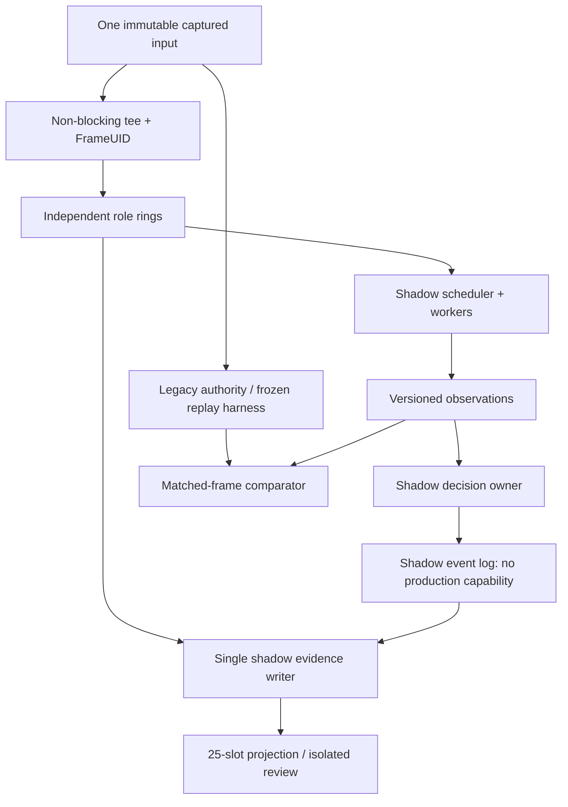

# 3PM HV3 — Phase 0 + Phase 1 Implementation Contract v1.0

วันที่: 1 ตุลาคม 2026 · ภาษา normative: MUST/ห้าม = ข้อบังคับ; SHOULD = หากไม่ทำต้องบันทึกเหตุผล

**การตัดสินใจ:** Option 2 — Major Refactor แบบ staged migration ได้รับเลือกแล้ว เอกสารนี้กำหนดงานให้ implementer ไม่ใช่ code patch และไม่ใช่การอนุมัติ promote ระบบใหม่ ในรอบจัดทำเอกสารไม่มี application code เปลี่ยนและไม่มี build ใหม่

**Source of Truth:**
- `3PM_HV3_Architecture_Audit_TH(2).md` SHA-256 `5e41ceb1fc9900ce84395b283a3a216e07c6c7337f48c6f594730897fcac8624`
- `3PM_Analyzer_Mac_20261001_R6_HV3_ThreeCameraFoundation (1).zip` SHA-256 `1bc31b86216222c5691b3d7bd1e649d1294595b17e67260ec72e9ff15082ffcd`
- ZIP ตรงกับ baseline ที่ audit ก่อนหน้า; `AGENTS.md`, `PROJECT_STATE.md`, `docs/QA_CURRENT.md` ยังใช้ประกอบกับคำสั่งล่าสุด ไม่ใช้ข้อความ “fixed/guaranteed” ใน QA เดิมลบล้าง findings ที่ audit พิสูจน์แล้ว

**ขอบเขตของสอง phase:** Phase 0 เก็บ baseline/instrumentation/repro โดยไม่เปลี่ยน production shot decision หรือแก้ production evidence/UI แอบแฝง Phase 1 สร้าง pipeline ใหม่ใน sandbox/shadow ที่เขียนได้เฉพาะ namespace ของตน Legacy ยังมี sole production authority ข้อกำหนดใหม่ทั้งหมดใช้กับ shadow path; บั๊ก legacy ที่เปิดไว้ยังต้องรายงาน ไม่ให้ shadow tests ผ่านแล้วเรียก legacy ว่าหายแล้ว

**ข้อจำกัดที่ต้องเปิดเผย:** ZIP ไม่มี Go backend source/build recipe. อำนาจแก้ frozen `app.js`, `pose.js`, `core_runtime.js` และ native binaries ยังไม่ได้ปลดล็อกโดยการเลือก Option 2 เพียงอย่างเดียว เอกสารระบุ narrow thaw ที่จำเป็นและจุดหยุดไว้ การสร้างเอกสารนี้ไม่ต้องรอการอนุญาตนั้น

## 1. Architecture Invariants

แต่ละ invariant ต้องมี test ID ใน acceptance report; exception ต้องเป็น blocked/not-supported ที่ระบุชัด ห้ามเงียบแล้ว fallback เป็นข้อมูลที่แต่งขึ้น

| ID | กฎที่ implementation ห้ามละเมิด | วิธีพิสูจน์หลัก |
|---|---|---|
| INV-001 | Unknown timestamp/sequence/quality ต้องเป็น null พร้อม reason ห้าม Number(null), empty string หรือ boolean กลายเป็น 0 | null/type corpus |
| INV-002 | หนึ่ง accepted source sample มี FrameUID เดียวที่ immutable ภายใน source/generation; encode, ROI, retry ใช้ UID เดิม | tee/retry/transform tests |
| INV-003 | UID ไม่ใช้ timestamp หรือ pixel hash เพียงอย่างเดียว; ภาพคนละ sample แม้เวลา/ภาพเท่ากันห้าม dedup | 240 FPS/identical pixels |
| INV-004 | restart/reconnect/backend switch ต้องได้ generation ใหม่; stale generation ห้ามแก้ live state ปัจจุบัน | restart/race tests |
| INV-005 | source time, arrival, inference start/end, decision time เป็นคนละ field; ห้ามแทนกันโดยไม่ระบุ semantics | delayed inference replay |
| INV-006 | เวลาเปรียบเทียบกันได้เมื่อ masterClockId/mapping version มี provenance; epoch ใช้แสดงผล ห้ามเรียงเหตุการณ์หลัก | clock-domain tests |
| INV-007 | mapping unknown/uncertainty unknown ห้ามปลอม source-frame time ด้วย arrival time; เก็บ frame ได้แต่ temporal comparison ไม่ผ่าน | unknown clock tests |
| INV-008 | Mapping revision ห้ามแก้เวลาของ frame/ผลที่เผยแพร่แล้วในที่เดิม; reprocess ต้องสร้าง revision ใหม่ | replay hash |
| INV-009 | Production มี shot decision owner เดียว; Phase 0–1 คือ legacy เท่านั้น; shadow ไม่มี commit capability | sink-isolation tests |
| INV-010 | retry event/commit ต้องให้ผลเดิม ไม่สร้าง shot ซ้ำ; identity ห้ามจับคู่ด้วย epoch ใกล้กัน | idempotency/concurrency |
| INV-011 | candidate → confirmed/rejected/uncertain; terminal immutable; late evidence สร้าง assessment revision ไม่ย้อน terminal เดิม | state-machine tests |
| INV-012 | ห้ามเพิ่ม mandatory visible Expansion, Hold timeout ที่สร้าง shot, หรือ exaggerated hand travel | inherited release regressions |
| INV-013 | Evidence Writer เป็นผู้เขียน durable shadow evidence เพียงรายเดียว; producer ส่ง command ห้าม put record เอง | capability/transaction tests |
| INV-014 | stale whole-record replacement เป็นข้อผิดพลาด; additive merge ต้อง idempotent/versioned และไม่ลบ Recovery | F04 interleavings |
| INV-015 | แต่ละ projection มี 25 logical slots ต่อ role ที่ active ใน cycle; role ไม่ active แสดง inactive ได้ 25 ช่องโดยไม่คิดเป็น missing | slot cardinality |
| INV-016 | real slot ต้อง resolve ถึงภาพจริง+FrameUID; ห้าม interpolation/duplicate เพื่อเติมให้ครบ | blob/UID integrity |
| INV-017 | UID เดียวห้าม occupy สอง real slots ใน shot/role/projection เดียว; candidate reuse ข้าม projection revision ทำได้ | injective assignment |
| INV-018 | Missing อยู่ logical slot ของ phase/target ที่ขาด ห้ามเลื่อนภาพอื่นมาอุดแล้วเติม Missing ท้ายทั้งหมด | sparse-phase fixtures |
| INV-019 | Camera rings/queues เป็นอิสระ; Side decision ไม่รอ auxiliary frame, inference หรือ persistence | stalled-aux tests |
| INV-020 | เปิดทุก subset 1/2/3 roles ได้; เมื่อไม่มี Side ใน Phase 0–1 ต้องไม่อ้าง automatic-shot parity หรือเลือก role ใหม่เอง | 7 role subsets |
| INV-021 | Routing เป็นราย role+generation+backend ห้ามใช้ backend ของ Side สั่งทั้งระบบ | mixed-backend matrix |
| INV-022 | Shared schemas, reducer, projector, writer semantics เหมือนกันบน Mac/Windows; OS-specific อยู่ adapter | shared golden fixtures |
| INV-023 | Windows stub ต้องรายงาน unavailable; sentinel/unit pass ห้ามแสดง native runtime supported | capability contract |
| INV-024 | Crash recovery ต้องได้ pending/complete/failed ที่ตรวจสอบได้; ห้าม report durable ก่อน transaction complete | crash-point tests |
| INV-025 | Archive round-trip ต้องคง identities, source/mapped times, mappings, phase evidence, slots, blobs และ versions | canonical round-trip |
| INV-026 | UI อ่าน snapshots และส่ง user intent เท่านั้น ห้าม commit shot/write evidence/reclassify phase | UI capability tests |
| INV-027 | render snapshot เดิมต้องไม่สร้าง self-trigger loop; observer ห้ามใช้ output ของ renderer เป็น trigger วน | F01 DOM test |
| INV-028 | Matched-frame A/B ต้อง FrameUID เดียวและ input derivation ตรวจสอบได้; nearest-time เป็นเพียง cross-view alignment | A/B join tests |
| INV-029 | Traces/buffers/queues มี byte/count limits และ dropped telemetry counters; logging ห้าม block production | load/quota tests |
| INV-030 | Shadow storage/log/archive ไม่เขียน legacy namespace, catalog, session หรือ athlete data | storage/API deny tests |
| INV-031 | Sensor เป็น observation ที่มี clock uncertainty; sensor impulse เพียงอย่างเดียวไม่ commit shot | sensor conflict tests |
| INV-032 | Bridge ต้อง local-only, authenticated, origin-restricted; mutable manager state มี serialized owner | security/race suite |
| INV-033 | Raw measurements, algorithm assessment และ coach conclusion แยกกัน; unknown ไม่เป็นคะแนนแน่นอน | schema/UI tests |
| INV-034 | Frozen hashes/known failures ห้ามแก้เพื่อให้ gate เขียว; การตรวจที่ไม่ได้ทำต้องเป็น not-run | release evidence review |

## 2. Canonical Data Contracts

### 2.1 Wire conventions และ identity

Schema namespace `3pm.analyzer.shadow.v1`; ไม่แก้ความหมาย `3pm-capture-v1` เดิม ใช้ explicit legacy-to-shadow adapter. Protocol เพิ่มเติมต้อง negotiate capability/version; peer ที่มีเพียง v1 จะได้ unknown สำหรับ field ที่ไม่มี ไม่เติม 0

- JSON wire; field ที่ระบุใน schema ต้องมีครบ unknown ใช้ `null`; absent field = invalid ใน v1. Optional extension อยู่ `extensions` namespaced เท่านั้น
- `ID` = non-empty opaque string; runId/cycleId/sourceId/streamGeneration/projectionId/experimentId ใช้ UUID; ห้าม derive device identity จาก label อย่างเดียว
- `U64` = decimal string ของ unsigned integer; frameSeq ไม่ผ่าน JavaScript Number. `I64` = signed decimal string; BigInt ใช้ภายในได้แต่ serialize เป็น string
- `TimeUs` = signed safe integer microseconds เทียบ session master origin; valid 0 คือ known zero เท่านั้น. `DurationUs` = nonnegative safe integer. Absolute times ใน object เดียวต้องอ้าง masterClockId เดียวกัน
- Source PTS = I64 ticks; `sourceTimebase={numerator:U64, denominator:U64}` seconds/tick ทั้งสองต้อง >0; conversion ใช้ rational arithmetic แล้ว round half-to-even เป็น microseconds
- `role` enum `side|overhead|rear`; `backendId` enum `browser|avfoundation|mediafoundation|replay|other`; other ต้องมี namespaced name
- `FrameUID` = `f1/` + canonical tuple `[runId,sourceId,streamGeneration,frameSeq]` ที่ encode แบบ length-prefixed UTF-8 และ SHA-256. Tuple ต้องเก็บอยู่ด้วยเพื่อ collision validation. ไม่ใส่ role เพื่อไม่ให้การแสดง sample เดียวอีก view สร้าง physical frame ใหม่
- Role Registry ต้องปฏิเสธการผูก sourceId+generation เดียวกับสอง physical roles พร้อมกัน เพื่อไม่อ้างว่า duplicate view เป็นอีกกล้อง; mirrored UI view ใช้ role เดิม. sourceId แทน acquisition stream/device binding; browser capture กับ native capture ของกล้องตัวเดียวกันถือคนละ stream จนกว่าจะเป็น fan-out จาก accepted sample เดียวจริง ห้ามตั้ง UID เท่ากันเพราะภาพคล้ายหรือ timestamp ใกล้
- Adapter กำหนด frameSeq ตอนรับ sample ครั้งแรก เริ่ม `"1"`, เพิ่มทุก sample แม้ drop ขั้น encode ภายหลัง. retry ส่ง UID เดิม. sourcePTS หายยังมี frameSeq ได้
- Legacy imported frame ที่ไม่มี original identity ใช้ identity kind `legacy-artifact`, UID จาก archiveId+recordKey+frameIndex; หมายถึง unique archived artifact ไม่อ้าง physical sample truth, ไม่ใช้ใน matched-frame certification
- ทุก record มี `schemaVersion`, `recordKind`, `runId`, `createdByVersion`; content hashes ใช้ canonical UTF-8 JSON: sorted keys, no whitespace, finite numbers, preserve null/array order; binary hashes SHA-256 exact bytes

### 2.2 FrameEnvelope

| Field | Type / null rule | Sole field authority |
|---|---|---|
| schemaVersion, recordKind | constants `3pm.analyzer.shadow.v1`, `frame` | schema validator |
| runId | ID non-null | Run Registry |
| role | role non-null; assignment snapshot | Role Registry |
| sourceId, streamGeneration | ID non-null | Camera Adapter via registry |
| frameSeq, frameUID | U64 / ID non-null | Camera Adapter; validator recomputes UID |
| identityKind | `source-sample|legacy-artifact` | ingress adapter |
| sourcePTS | I64|null | OS/browser source metadata only |
| sourceTimebase | rational|null; required iff sourcePTS known | adapter |
| clockId | ID non-null even if PTS unknown | adapter per source clock instance |
| timestampKind | `exposure|presentation|callback|unknown` | adapter based on supported source API |
| sourceTimeMissingReason | enum|null; null iff PTS known | adapter |
| masterClockId | ID non-null | Run Clock Authority |
| mappedMasterTime | TimeUs|null | Clock Mapper only |
| mappingUncertainty | DurationUs|null | Clock Mapper only; null = unknown bound |
| mappingId, mappingVersion | ID|null, positive integer|null; both known or both null | Clock Mapper |
| mappingStatus | `validated|provisional|unmapped|discontinuous` | Clock Mapper |
| arrivalTime | `{clockId:ID,ticks:I64,timebase:rational,masterTime:TimeUs|null,mappingId:ID|null}` | adapter raw clock; mapper normalized field |
| width,height | positive integer; invalid dimensions reject envelope | adapter, actual input raster dimensions |
| rotation | `0|90|180|270` | adapter |
| mirror | boolean|null; null disqualifies geometry A/B until resolved | adapter |
| pixelFormat | string non-null | adapter |
| nominalFPS, measuredFPS | finite positive number|null, separately | negotiated format / telemetry |
| quality | `{decodeValid:boolean,trackingConfidence:number|null,blurScore:number|null,exposureClipped:boolean|null,qualitySchema:string,flags:string[]}` | adapter owns decode; analysis enrichments stored separately by version, not mutate frame |
| dropCounters | `{source:U64|null,transport:U64|null,encoder:U64|null,counterScope:ID}` | adapter per generation; unknown counter not 0 |
| backend | `{id,version,platform,adapterInstanceId}` non-null strings | adapter |
| payloadRef | ID|null; null requires payloadState `unavailable` | ingress/ring handle registry |
| payloadState | `available|unavailable|evicted` | lifetime ledger; immutable envelope records initial state; later transitions events |
| transformId | ID non-null (`identity` record permitted) | Transform Registry |
| contentDigest | SHA-256|null; null until async digest event; never force hashing on capture thread | payload verifier |

Envelope ที่ publish แล้ว immutable. Capture ingress ส่ง raw identity+time ก่อน; Clock Mapper สร้าง mapped view มี mapping revision ห้าม mutate raw. Recalibration สร้าง view revision ใหม่ ไม่เปลี่ยน UID. Derived ROI/resize/JPEG ถือ `derivationId` ใหม่ พร้อม parent frameUID/transform/version ไม่ mint physical frame ใหม่. Hash ของ JPEG กับ raw pixels ไม่จำเป็นต้องเท่ากัน จึงบันทึก derivation chain

**ClockMapping record:** mappingId/version, run/masterClockId, source clockId+generation, model=`affine`, scale numerator/denominator, offsetUs, valid source-tick interval, calibration method, calibration sample IDs, residualBoundUs|null, transportBoundUs|null, uncertaintyBoundUs|null, timestampKind, status. mapping ทำนอก capture thread; Phase 1 ใช้ adapter-validated conversion หรือ calibration anchors ที่มี bound เท่านั้น ถ้ามีเพียง callback pairs ให้เป็น provisional ไม่อ้าง exposure time. Clock handshake ประเมิน process offset/transport ได้ แต่ไม่ได้พิสูจน์ exposure↔PTS latency

Run master = monotonic origin ของ dedicated host/worker authority หนึ่ง instance. Browser-only ใช้ dedicated coordinator worker เป็น authority; native process clocks map เข้าหามัน. Authority restart สร้าง runId/masterClockId ใหม่. Worker initialization เก็บ clock origin และ mapper provenance ไม่ถือว่า performance.now() ของต่าง process มี origin เดียวกัน. Wall time เก็บเป็น optional display anchor เท่านั้น

Phase 0 ไม่ map เวลา legacy ย้อนหลังแบบเดา: เก็บ legacy epoch แยก พร้อม mappingStatus=unmapped หากไม่มีหลักฐาน. สำหรับ frame ที่ mapping provisional/unmapped ใช้เปรียบภาพ UID ได้ แต่ห้ามใช้เป็น certified temporal comparison/real timed slot

### 2.3 Observation

| Field | Type / rule | Authority |
|---|---|---|
| observationId | deterministic ID จาก producerInstance+producerVersion+input IDs+config hash+attempt logical ID | Observation Producer |
| runId, masterClockId | ID | Run Registry |
| kind | `pose|motion|hand|sensor` | producer |
| role | camera role; sensor ใช้ null พร้อม sensorId | producer binding |
| frameUIDs | ID[] ordered; pose/hand ≥1, motion ≥2 เว้นแต่ algorithm ประกาศ single-frame; sensor = [] | input envelope references |
| sensorSampleUIDs | ID[]; sensor ≥1, camera = [] | Sensor Adapter references |
| sourceInterval | `{start:TimeUs|null,end:TimeUs|null,uncertaintyUs:DurationUs|null,mappingRefs:ID[]}` | Clock Mapper-derived; no fake point time for window |
| inferenceStart,inferenceEnd | `{masterTime:TimeUs|null,rawClockId:ID,rawTicks:I64}` | producer timing |
| receivedAt | TimeUs | observation ingress |
| producer | `{algorithmId,modelDigest,codeVersion,configDigest,instanceId}` | producer |
| transformIds, derivationIds | ID[] | input lineage |
| status | `valid|partial|unobservable|invalid` | producer |
| confidence | number 0..1|null; calibrated flag required; not universal cross-model scale | producer |
| payloadSchema,payload | discriminated versioned schema/object | producer |
| reasonCodes | string[]; mandatory for non-valid | producer |

Payload contracts: pose/hand landmarks = named/indexed points with x/y/z nullable, coordinateSpace=`full-frame-normalized|roi-normalized|world-estimate`, units, visibility/confidence; missing point null ไม่ใช้ (0,0). Motion = measurementId/value|null/unit/axis/referenceFrame/window/covariance|null. Sensor = sample rate/unit/axes/mount transform/calibrationId/synthetic flag and source sample IDs. Real transport/synthetic measurements แยก flag; ห้าม fake heartbeat/device ID. New producer/payload version ต้องเพิ่ม schema+golden tests ก่อนใช้

### 2.4 ShotCycle และ ShotEvent

**ShotCycle:** cycleId/runId, authorityRole=`side` ใน Phase 0–1, authorityNamespace=`legacy-production|shadow/<experimentId>`, sessionRef opaque|null, state=`candidate|confirmed|rejected|uncertain`, startedAtSourceTime|null, terminalAtSourceTime|null, candidateObservationIds[], phaseEvidence[], activeRoleSnapshot[], roleBindingHistory[], decisionPolicyVersion/configDigest, latestEventSeq U64, recordVersion integer.

`phaseEvidence[]` item = phase enum `set|setup|draw|anchor|hold|expansion|release|follow_through|recovery`, start/end TimeUs|null, status=`verified|provisional|unknown`, observationIds[], masterClockId, uncertaintyUs|null. “verified” ใน shadow หมายถึง algorithm evidence ที่ผ่าน contract ไม่ใช่ coach ground truth; เก็บ label reference แยก

ActiveRoleSnapshot lock ตอนเปิด candidate: roles ที่ enabled และมี valid binding แม้ขณะนั้นชั่วคราวไม่มี frames ก็ยัง active. Role เพิ่มหลังเริ่ม cycle รอ cycle ถัดไป; disconnect ระหว่าง cycle ไม่เปลี่ยน active เป็น inactive เพื่อซ่อน Missing. roleBindingHistory เก็บ generation/time intervals เพื่อใช้ frame ก่อน disconnect ได้และปฏิเสธ stale events ที่พยายามแก้ current binding

**ShotEvent:** eventId, cycleId/runId, seq U64, eventType=`candidate|confirmed|rejected|uncertain`, sourceEventTime TimeUs|null, sourceInterval/uncertainty, decidedAtMasterTime TimeUs, recordedAtMasterTime TimeUs, supportingObservationIds[], contradictingObservationIds[], reasonCodes[], policyVersion/configDigest, eventNamespace, idempotencyKey, previousEventDigest|null, eventDigest, simulatedShotId|null, legacyShotRef|null.

- cycleId ถูกกำหนดโดย cycle owner ครั้งเดียวแล้วบันทึกใน input tape; replay ใช้ ID เดิม. eventId/idempotencyKey derive จาก `[namespace,runId,cycleId,seq,eventType,policyVersion]` แบบ canonical tuple/hash
- candidate เป็น nonterminal; confirmed/rejected/uncertain terminal หนึ่งครั้ง. Additional candidate evidence เป็น cycle update ที่เพิ่ม observation refs ไม่สร้าง candidate identity ใหม่
- repeated key+same digest = return existing; same key+different payload = hard conflict quarantine. Confirmed shadow ออก simulatedShotId ใน namespace shadow เท่านั้น ห้ามใช้ production shot ID หรือเรียก `/api/*` mutation
- Legacy numeric shot ID เก็บเป็น external reference ไม่ใช้เป็น global identity. การ link legacy cycle กับ shadow cycle ต้องอ้าง input trace/UID anchor ที่ตรงกัน; ambiguous = unlinked ไม่ใช้ ±400 ms join
- Phase 1 reducer เป็น deterministic replay ของ validated legacy policy ผ่าน pure adapter ก่อน ยังไม่ปรับ thresholds/model. หากไม่สามารถ extract โดยไม่เปลี่ยน behavior ให้ replay algorithm ที่มี pure entrypoint และรายงาน coverage; ห้ามอ้าง full decision parity
- Input order ใช้ Side frameSeq ภายใน generation + source interval สำหรับ motion/sensor; ผล inference out-of-order ให้บัฟเฟอร์ไม่เกิน 200 ms arrival time เป็น **engineering shadow policy** ที่ versioned. ข้ามช่องว่างเมื่อ timeout พร้อม gap event; later results เก็บเพื่อ offline reassessment ไม่แก้ terminal. Auxiliary ไม่อยู่ใน watermark/barrier นี้
- เมื่อ Side generation เปลี่ยนหรือ source clock discontinuity: candidate ที่ยังไม่ terminal → uncertain(reason=authority_stream_reset); cycle ใหม่ต้อง reacquire, ไม่ต่อ history อัตโนมัติ. ถ้าไม่มี Side ให้ evidence-only; ไม่สร้าง auto candidate จาก aux
- Timeout ให้ uncertain ได้แต่ห้ามสร้าง confirmed; ระยะ candidate timeout ใช้ค่าเดิมจาก policy ที่ extract เท่านั้น ไม่กำหนด Hold timeout ใหม่ใน contract นี้. หากไม่มี timeout เดิมให้ explicit end/reset/unobservable policy ปิด cycle โดยไม่ fabricate release

### 2.5 EvidenceCandidate และ writer command

EvidenceCandidate fields: candidateId=hash(runId,cycleId,role,frameUID,derivationId), runId/cycleId/role/frameUID, frameEnvelopeRef+mappingRevision, derivationId, blobDigest/ref/mime/byteLength, phaseClaims[] (phase/status/observationIds), qualityAssessmentRef|null, receivedAtMasterTime, provenance=`source-sample|legacy-artifact`, producerVersion, eligibility=`eligible|ineligible|pending`, ineligibleReasons[]. Evidence candidates append-only; claim ใหม่เป็น assessment revision ไม่ rewrite original

Writer รับเฉพาะ command `{commandId,namespace,runId,cycleId,role,expectedRecordVersion,operation,payloadDigest,payload}`; operations=`addCandidates|addPhaseEvidence|saveProjection|finalizeCycle`. Caller ห้ามส่ง replacement ทั้ง record. `finalizeCycle` ใน Evidence Writer หมายถึง finalize evidence materialization ใน `evidenceRecords` เท่านั้น ไม่เปลี่ยน ShotCycle state; state ใน `cycles` เป็นของ Shot Event Log. expectedRecordVersion อ้าง evidence aggregate version ต่อ run/cycle/role ไม่ใช่ classifier state version. Merge candidate set ด้วย candidateId/UID+derivation; phase claims union by claim ID; conflicting same ID/different digest quarantine. Terminal phase/end time ห้ามเปลี่ยนย้อนหลังด้วย stale lower revision

**Shadow persistence ตัดสินไว้:** dedicated worker/isolated diagnostic page origin เปิด IndexedDB `3pm-shadow-v1` คนละ origin/port กับ production; stores `runs,frames,observations,cycles,shotEvents,evidenceRecords,candidates,blobs,projections,commands,journal,clockMappings,transforms` ชื่อ store ห้าม `shotEvidence` เพื่อหลบ global legacy prototype normalization. Evidence Writer เป็นเจ้าของ write transaction ของ evidence-related stores; Shot Event Log เป็นเจ้าของ events/cycles ผ่าน transaction API ที่แยกสิทธิ์ ไม่เขียน evidence

Blob+candidate+command result+journal commit ใน IndexedDB transaction เดียวกันเมื่อ payload เตรียมพร้อมแล้ว; fetch/hash นอก transaction. Transaction reread version และ merge ภายใน; version mismatch คืน conflict/rebase ไม่เขียน stale record. Frame/mapping/observation producers เขียน durable ผ่าน storage gateway ที่ให้ capability เฉพาะ store ของตน; ห้าม import Evidence Writer internal DB handle. มี writer instance เดียวต่อ namespace; second opener read-only จน lock/lease ถูกยืนยัน (exclusive browser lock + fencing token persisted checked in every transaction). หาก platform ไม่มี equivalent exclusive lock ให้ read-only/offline tests ไม่เปิดสอง writer โดยเดา

Crash ก่อน commit = ไม่มี committed command; retry commandId เดิมได้. Crash หลัง commit ก่อน ACK = retry คืนผลเดิม. QuotaExceeded abort ทั้ง transaction, เก็บ pending error ใน bounded diagnostics, ห้ามแสดง completed. ไม่มีคำสัญญา transaction atomic กับ legacy backend; Phase 1 ไม่แตะมัน

### 2.6 EvidenceSlot และ deterministic 25-slot plan

| Field | Type / rule |
|---|---|
| slotId | stable `S01`..`S25`; logical ID คงที่ทุก shot และทุก role |
| phase | `draw|anchor|hold|expansion|release_window|follow_through|recovery` |
| role,runId,cycleId | non-null identity |
| targetMasterTime | TimeUs|null; null เมื่อ phase boundary ไม่ทราบ |
| masterClockId | ID |
| actualFrameUID,derivationId,candidateId | ID|null; ทั้งหมด required iff real |
| actualMasterTime | TimeUs|null; real requires known |
| signedDelta | signed integer us|null = actualMasterTime − targetMasterTime; real must exact |
| status | `real|missing|inactive` |
| missingReason | enum|null; null iff real; inactive=`role_not_active` |
| targetPhaseEvidenceRefs | ID[] |
| actualPhaseEvidenceRefs | ID[]; ห้ามเอา target label ไปประทับว่า actual phase verified |
| toleranceUs,mappingUncertaintyUs | DurationUs|null |
| projectionVersion,planVersion,projectionId | non-null; plan=`logical25-v1-shadow` |
| selectionReason,qualityAssessmentRef | string / ID|null |

**แผน slots v1 ตัดสินไว้ (รวม 25):**

| Slots | Phase | Target rule |
|---|---|---|
| S01–S02 | draw | 1/3 และ 2/3 ของ verified draw interval |
| S03–S05 | anchor | 1/4, 1/2, 3/4 ของ settled-anchor interval; ห้ามใช้ Draw เป็น Anchor |
| S06–S08 | hold | 1/4, 1/2, 3/4 ของ verified hold interval |
| S09–S10 | expansion | 1/3, 2/3 ของ verified expansion interval; ไม่มี visible Expansion → phase_unobserved ไม่กระทบ shot confirmation |
| S11–S19 | release_window | r + k×33,333 us, k=-4..4; r=source release estimate ที่ทราบ; S15=r; เป็น sampling window ไม่อ้างทั้ง 9 ภาพเป็น physical Release phase |
| S20–S24 | follow_through | 1/6..5/6 ของ verified follow-through interval |
| S25 | recovery | verified recovery endpoint |

นี่เป็น deterministic shadow sampling policy ไม่ใช่การอ้างว่า release ต้องกินเวลาตาม window นี้. ทุก role ใช้ target timeline เดียวกันที่ Side owner ออก; geometry/observability ของแต่ละ view ประเมินแยก. ไม่มี Side หรือ boundary ไม่ทราบ → target=null/missing reason=`phase_unverified|release_time_unknown`; manual/coach labels ใช้ทดลองได้เมื่อแยก `targetAuthority=coach-label` ไม่ปน automatic metrics

Eligibility: frame อยู่ role binding interval ของ cycle; valid blob/identity, validated mapping, finite uncertainty, decode valid. สำหรับ phase slots นอก release_window ต้องมี frame time อยู่ใน verified phase interval โดย uncertainty interval ไม่ล้ำขอบ; anchor ต้องไม่ก่อน settled-anchor boundary. Release_window อนุญาต pre/post frames ตามชื่อ ไม่แท็ก actual phase เอง

Tolerance: P=1,000,000/measuredFPS us จาก observed capture intervals; หากไม่มี observed ให้ใช้ negotiated FPS และ flag. หากไม่มีทั้งคู่ → missing=`cadence_unknown`. J=p95 absolute deviation ของ inter-frame interval จาก median ใน generation เดียว; U=mappingUncertainty. `T=min(50,000, ceil(P/2 + J + U))` us. U>50,000 หรือ null → ineligible=`clock_uncertain`; eligible edge เมื่อ |delta|≤T และ phase constraints ผ่าน. 50 ms เป็น engineering selection cap สำหรับ shadow v1 ไม่ใช่ field accuracy claim

Assignment: สร้าง bipartite graph slots↔eligible frameUIDs; เลือก maximum-cardinality injective matching จากนั้น minimize total absolute delta; tie เลือก lexicographically by ordered list `(slotId,frameUID,derivationId)`; derivation ของ UID เดียวเลือกหนึ่งด้วย policy `(decodeValid, higher actual resolution, lexical derivationId)` ห้ามเลือกตาม Mac brand/backend. เก็บ full candidate set เพื่อ replay. ไม่เลือก frame แบบ greedy ที่เปลี่ยนผลตาม fetch completion order

Missing reasons enum อย่างน้อย: `role_not_active,phase_unobserved,phase_unverified,release_time_unknown,clock_unmapped,clock_uncertain,cadence_unknown,no_frame_in_tolerance,unique_frame_exhausted,stream_disconnected,buffer_expired,encoder_drop,transport_drop,payload_missing,decode_failed,storage_failed,generation_mismatch,source_unobservable`. ใช้เหตุเฉพาะเมื่อมี trace ยืนยัน มิฉะนั้น `no_frame_in_tolerance`; มี diagnostic contributingReasons[] เพิ่มได้

Projection immutable และมี input candidate digest, phase timeline digest, config digest, mapping versions. Late Recovery สร้าง projection revision ใหม่ ไม่แก้เดิม. Logical slot order ไม่จำเป็นต้องเป็น chronological frame order เพราะ release window อาจ overlap phase อื่น; replay timeline ต้องเรียง actualMasterTime, then source/generation/frameSeq/UID และไม่เดินภาพย้อนตาม slot ID. Anchor button เลือก real S03–S05 ที่ผ่าน settled-anchor constraint หรือแจ้ง Missing ห้าม fallback ไปภาพไม่มี phase proof

Inactive role อาจมี 25 inactive rows สำหรับ layout; ไม่รวมใน coverage denominator. Active role ที่ disconnected ยัง 25 slots และ missing ตรงช่วงที่ขาด. เก็บ `uniqueRealCount`, `missingCount`, `inactiveCount` แยก โดยผลรวม=25 ทุก role

### 2.7 Archive schema requirements

Archive format `3pm-shadow-archive-v1` แยกจาก legacy export. Manifest: archiveId, schemaVersion, baseline package digest, experiment/run/cycle IDs, all code/model/config digests, source capability profile, master clock records/mappings, transform/derivation graph, active role snapshots/binding history, observations/events, candidates, all projection revisions, labels/provenance, file table `{path,mime,byteLength,sha256}` และ manifest content digest

- blobs content-addressed SHA-256; image bytes ไม่ re-encode ระหว่าง export/import. logical identifiers, nulls, source ticks/timebase, master time/uncertainty, reason codes และ event order ต้อง round-trip exact
- Import เข้า namespace ใหม่ เก็บ origin IDs เดิมพร้อม importInstanceId แยก; local DB keys prefix import instance ไม่ mint FrameUID ใหม่หรือแก้ run clock; duplicate archive import idempotent หรือเปิดอีก read-only copy ที่ระบุชัด
- Validate schema/hash/size/references/path traversal และ limits ก่อน commit staging→complete; corrupted/missing blob quarantine ไม่แสดง real slot. Unknown newer schema เปิด read-only/unsupported ไม่ drop fields แล้ว save ทับ
- Legacy archive reader เก็บ raw original manifest/blob และ origin field mapping; missing provenance ใช้ null+`legacy_unavailable`, ห้ามสร้าง sequence/time ที่อ้างเป็น original. Legacy imports ไม่ผ่าน matched-frame gate
- Phase 1 export/import tests ทำใน shadow namespace เท่านั้น; ห้ามเปลี่ยน `app.js` production archive path ในรอบนี้

## 3. Ownership Matrix

คำว่า sole owner ระบุ namespace ด้วย: legacy production writer หลายตัวเป็น known defect ที่ยังไม่ย้ายใน Phase 0–1 ไม่เอาการมี shadow writer ใหม่ไปอ้างว่า production ถูกแก้แล้ว

| Subsystem | Sole owner / เขียนอะไร | รับ/ส่ง | สิ่งที่ห้าม |
|---|---|---|---|
| Run/Role Registry | run/master identity, role bindings/generation lifecycle | adapter status → immutable registry events | infer device ID จาก label; เปลี่ยน binding โดยไม่ event |
| OS Camera Adapter | source sample identity, raw time, device capability, counters | physical sample → FrameEnvelope raw | classify shot; map unknown เป็น known; เขียน evidence DB |
| Clock Mapper | mapping records และ mapped views | raw clock+calibration → immutable mapped view | rewrite raw PTS/เก่าผลลัพธ์ |
| Role Ring Buffer | per-role payload lifetime/retention/eviction events | frame refs → leased immutable candidates | รอกล้องอื่น; ลบ pinned payload เงียบ ๆ |
| Analysis Scheduler | admission/priority/bounded jobs/drop-analysis counters | frame leases → producer tasks | แก้ source time, delay Side เพื่อรอ aux |
| Observation Producer | observation payload/processing timings | exact inputs → versioned observations | commit shot/write candidate records |
| Shot Decision Owner | cycle transitions/proposed ShotEvents | observations → ordered event proposals | มี production owner สองราย; shadow เรียก production mutation |
| Shot Event Log | durable event/cycle append, idempotency/sequence verification | proposals → append result | ตัดสินใหม่/เขียน evidence blobs |
| Evidence Writer | shadow candidates/blobs/projections/journal/commands | explicit commands → versioned snapshots | whole-record stale put; ส่ง shot commit |
| 25-Slot Projector | pure selection plan/result; ไม่มี durable write | candidate snapshot+phase proof → projection | put DB, delete candidates, fabricate frame |
| Review UI | rendered state + user intent | snapshots → UI; intent → controller | observer loop, auto repair DB, relabel phase |
| Archive Service | versioned export/staging validation/import requests | snapshots ↔ archive → writer/log APIs | เขียน DB ข้าม owners, overwrite original provenance |
| Bow Sensor Adapter | device/sample identity, raw sensor time, real heartbeat, calibration/mount metadata | physical Link/BLE/WS → sensor envelopes | fake device/online; commit shot; assume clock synced |
| Shadow Comparator | unique matched pairs and comparison results | same UID/derivation observations → metrics | timestamp-nearest เป็น matched truth; count latest sample ซ้ำ |

Decision/log transaction contract: owner เสนอ event; log validate expected seq+digest แล้ว append atomically. Evidence readiness ไม่เป็นเงื่อนไขบังคับ Side decision รอ auxiliary. Event เป็น confirmed แล้ว evidence missing สามารถคง confirmed พร้อม evidence status incomplete; ห้ามแก้ classification เพื่อให้รูปดูครบ

## 4. Phase 0 Exact Work Plan

### 4.1 Dependency order และผลส่งมอบ

ชื่อใต้ `app/shadow/` และ `app/tests/phase01/` ต่อไปนี้เป็น **proposed new paths** ไม่อ้างว่ามีใน ZIP แล้ว ทั้งหมดสร้างใน development checkout ใหม่ ไม่แก้ไฟล์ต้นฉบับที่แนบ

| Order | งาน / ไฟล์ inspect หรือ proposed touch | สิ่งเพิ่มและ gate | ห้ามเปลี่ยน / rollback |
|---|---|---|---|
| P0-00 | ZIP manifest, AGENTS, PROJECT_STATE, docs/QA_CURRENT, HANDOFF, PACKAGE_CONTRACT, SHA256SUMS | source digest inventory, known-failure register, dev branch/tag `hv3-audit-baseline`; ตรวจ ZIP executable attributes | ห้าม refresh expected frozen hashes ให้ match code ใหม่; rollback checkout baseline |
| P0-01 ←00 | tests เดิม, audit repros | rerun regression/static tests ใน isolated profile; capture environment/tool versions/results; ระบุ fail/not-run จริง | ไม่ใช้ user DB หรือ original sessions; known failures ไม่ซ่อนใน summary |
| P0-02 ←00 | proposed `app/shadow/contracts/`, `docs/PHASE01_CONTRACT.md` | JSON schemas ตามส่วน 2, namespace/capability denylist, canonical identity/time utilities, fixtures | ยังไม่ wire production; revert docs/module commit |
| P0-03 ←01,02 | inspect evidence_integrity_repair_layer, evidence_budget_core/layer, camera_timeline_core | minimal F01/F02/F03 red tests + source characterization tests; proposed `app/tests/phase01/repro_*` | ห้ามแก้ legacy UI/budget/clock เพื่อให้ Phase 0 เขียว |
| P0-04 ←03 | inspect app.js evidenceDbPut/Merge/Recovery, native_capture_layer findRecord/collectBundle, temporal_evidence_layer | F04 controlled interleaving test และ writer call graph; capture identity/recordVersion before-after | read-only inspect frozen app; no monkeypatch global IDB in shipped app |
| P0-05 ←02 | proposed `app/shadow/telemetry/`, `app/shadow/replay/` | bounded event tape + deterministic virtual-clock runner + fixture provenance manifests; seeded inputs | ไม่ใช้ Date.now/random/network completion เป็น input ที่ไม่บันทึก |
| P0-06 ←05 | inspect pose.js processRole/computeMetrics/loop, capture_integrity_layer, native/temporal capture, native_vision_shadow_layer | approved boundary taps: source metadata, inference interval, decisions, persist request/ack; callback copies scalar snapshot non-blocking | ห้ามเปลี่ยน metrics epoch/thresholds/call order; no log IO/blob hashing in critical call |
| P0-07 ←06 | native Swift manager/HTTP, native_shared, Windows stub, bow_sensor_ble | capability/security/concurrency inventory; source timestamp semantics, manager queue ownership; no automatic enabling native shadow | ไม่เปิด insecure endpoint เพื่อ “ลองก่อน”; auth/bind repair reserved shadow adapter work |
| P0-08 ←05,06 | proposed `docs/phase01/baseline.json`, event fixtures | deterministic replay equivalence, load baseline matrix, observer effect measurement, stop thresholds profile | ถ้า instrumentation เปลี่ยน production result ให้หยุด live taps; กลับ offline instrumentation |
| P0-09 ←03…08 | docs/phase01/handoff + test results | Phase 0 completion manifest: pass/known-fail/blocked/not-run พร้อม scope; request narrow thaw หากจำเป็น | ไม่กล่าว Phase 0 complete-full หาก exact input tap ยัง blocked; offline subset complete ได้ |

### 4.2 Trace schema ที่ต้องเพิ่ม

ทุก event มี traceVersion/runId/experimentId/eventId/parentEventId|null/sequence, subsystem, eventType, producerVersion, source package digest, masterClockId, recordedAtMasterTime, role|null, sourceId/generation/frameUID|null, cycleId|null, namespace, payloadSchema, reasonCodes. Unknown/null ต้อง explicit

Capture: sourcePTS/timebase/clockId/timestampKind, mapped time+mappingId/version/uncertainty/status, arrival raw+mapped, dimensions/FPS/rotation/mirror, drops by stage, buffer bytes/coverage. Analysis: jobId/frameUID/input derivation+ROI transform/config hash, enqueue/start/end, queue depth/worker, accepted/dropped reason. Decision: legacy original metrics time (untouched), legacy phase/release flags before/after each orchestration layer, candidate/cycle reference, supporting/contradicting observation IDs, source estimate separate, decision time. Persistence: commandId/record key namespace/version read/version committed, writer identity, frame UID additions, projection revision, begin/commit/abort/quota. UI: snapshot digest/render count/observer callback count/task duration. Lifecycle: role generation transitions/backend and capability errors. Sensor: device/sample IDs, clock mapping, heartbeat real and synthetic-measurement flag

Telemetry default per process: 8 MiB in-memory ring หรือ 20,000 events whichever first; flush outside critical callbacks to diagnostic sink when enabled; overflow drops telemetry oldest + counters/sequence-gap marker. Frame payload ไม่ฝัง JSON trace; tape อ้าง blob manifest+hash. Frame capture tape มี independent byte quota; recording drop ต้อง mark coverage gap; captured data ที่ใช้เป็น regression fixture ต้อง pin/export ก่อน recycle. ห้าม log tokens/credentials/ข้อมูลส่วนบุคคลที่ไม่จำเป็น

### 4.3 Minimal repro และ red→green semantics

| ID / finding | Minimal repro ที่ต้องเก็บ | Baseline expected | Green condition ของ implementation ใหม่ |
|---|---|---|---|
| T-F01 | Chromium isolated panel+actual HV2 repair script, disable interval; external watchdog/count disconnect at 100 เพื่อไม่ hang test runner | callback self-trigger ถึง cutoff; desired bounded assertion FAIL | new renderer: one snapshot update → ≤1 scheduled render; same digest again → 0 DOM writes; drain microtasks จบ; no self-caused observer callbacks |
| T-F02a | 25 source records ต่าง UID, epoch ห่าง 34 ms, legacy mediaTime/frameSeq null | legacy canonicalUnique เหลือ 1 | all 25 retained in candidate pool; nullable source fields remain null; projection only real if separate timing requirements met |
| T-F02b | 25 unique frame UIDs/seq, PTS 240 FPS ห่าง 4,166.67 us, legacy epoch ≤8 ms neighboring | legacy retained 13 | retained 25; true retry UID duplicates collapse once; null/0 distinct |
| T-F03a | legacy masterTimeMs=null + known epoch | legacy returns 0 | new contract rejects mixing/no conversion: mappedMasterTime=null, epoch remains display metadata |
| T-F03b | tape source ticks 0/33,333/66,666 us, known mapping + delays 0/80/10 ms; simulated wall clock jump ±5 s | processing-time path changes timing/order; exact output characterize not assume failure mode | mapped source timeline/UID ordering unchanged for same tape; processing/decision timings differ separately; ambiguous mapping stays unknown |
| T-F04 | suspend native collect after reading record v1; Recovery adds frame/metadata v2; resume native stale put; compare final set | reproducible stale replace can remove Recovery; controlled schedule proof only, not proof field incident happened | single writer merges commands and retains union; all request-order permutations same canonical result; stale finalize returns conflict |

Phase 0 เก็บ desired red tests เป็น explicit known-failure suite แยกจาก baseline characterization ที่ assert observed behavior. CI ต้องรายงานทั้งสอง ไม่เปลี่ยน assert ให้ bug เป็น correctness. Green target ไปที่ new isolated modules ใน Phase 1; desired legacy tests ยังคง FAIL จน Phase ที่อนุญาต production repair. เมื่อ promotion ภายหลังแก้ legacy/replace path จึงเอา expected-failure waiver ออกทีละรายการ

### 4.4 Frozen files / exact-frame instrumentation seam

| File | Phase 0 default | Narrow thaw proposal / เหตุผล | สิ่งที่ยังห้าม |
|---|---|---|---|
| `app/static/pose.js` | inspect + external callback observation only | หากต้องพิสูจน์ exact legacy inference input ต้องมี trace-only seam รอบ `processRole`/`inferenceSource`/`detectForVideo` เก็บ immutable pixel/derivation token ก่อน inference และ bind result หลัง call; `_testComputeMetrics` อย่างเดียวไม่บอก input frame | เปลี่ยน timestamp ที่ส่ง engine, inference schedule, thresholds หรือเปลี่ยน video input เป็น canvas โดยเรียกว่า instrumentation |
| `app/static/app.js` | inspect และ isolated test injection | ไม่ต้อง thaw เพื่อสร้าง shadow writer/archive; หาก future production persistence hook จำเป็น ให้เสนอ API boundary diff แยกพร้อม test | legacy evidence/archive migration ใน Phase 0–1 |
| `app/static/core_runtime.js` | frozen untouched | ใช้ pure test entrypoints/VM harness ถ้ามี; extraction ต้องพิสูจน์ parity ก่อนเสนอ | edit release algorithm หรือ engine reset |
| Frozen Analyzer native binaries | untouched | ไม่มี narrow thaw ในสอง phase; ต้อง backend source/build recipe ก่อน | patch/rebuild binary โดยไม่มี reproducibility |
| Swift helper source | inspect ใน Phase 0 | Phase 1 อาจทำ separate adapter test target หลัง authorization: source identity, secure boundary, serialized manager, tee sample | แทน helper ที่ผู้ใช้รันโดยไม่มี Mac compile/runtime gate |

หากจับ immutable exact input ไม่ได้โดยไม่เปลี่ยน legacy input acquisition ให้ **หยุดอ้าง live matched-frame parity** ใช้ offline replay ด้วย frozen immutable raster เป็น common input ของ old/new test harness ก่อน. input ที่อ่านจาก live video สองครั้งแม้ภายใน callback เดียวอาจคนละ sample ห้ามมอบ UID เดียวโดยเดา. Narrow thaw/transport tee เป็น deliverable ที่ต้องได้รับอนุญาตก่อนแตะ frozen file; implementer ยังทำ P0 schemas/repros/offline baseline และ Phase 1 pure modules ได้ทันที ไม่ต้องรอเพื่อทำสิ่งเหล่านี้

F01 loop อาจทำ live baseline ใช้งานไม่ได้: บันทึก baseline blocked แล้วใช้ isolated controlled harness. ห้ามปิด legacy repair layer แล้วรายงานว่าได้วัด unmodified HV3; หากจำเป็นต้องทำ controlled mitigation ให้แยก experimental branch/config และไม่ใช้เป็นหลักฐานว่า production fixed

**Rollback Phase 0:** ปิด telemetry flag (default off), unload optional observer/diagnostic host, revert instrumentation-only commit, กลับ hashes เดิม; originals/fixtures/traces ไม่ลบ. เปิด session ใหม่เพื่อไม่ carry partial instrumentation state. ไม่มี DB migration จึงไม่ต้องแก้ production DB เพื่อ rollback

## 5. Phase 1 Shadow Pipeline Plan

### 5.1 Architecture และ execution boundary

Phase 1 เริ่ม offline replay แล้วค่อย live shadow เมื่อ exact-frame tap และ runtime/security gates ผ่าน. ใช้ isolated diagnostic host origin/port กับ dedicated workers; ไม่มี production cookies/DB/API client injected ให้ shadow. Messages allowlist typed, origin+session capability checked; production bridge ไม่รับ mutation จาก shadow. หน้าต่างหลักส่ง frame copy/lease refs แบบ bounded ไม่ await; allocation/copy overhead ต้องวัด ถ้ารักษา Side budget ไม่ได้ปิด live shadow แล้วทำ offline

Shadow experiment namespace `shadow/<experimentId>/<runId>`; output ทุกชนิดมี namespace นี้; UI diagnostic ติดป้าย Shadow ไม่ปน real shot list/baseline scoring. Offline fixture runner ไม่ต้องใช้ production backend. ถ้า local server ไม่มี way serve standalone diagnostics ให้ใช้ developer-only test host ไม่เปลี่ยน embedded/frozen backend เพื่อเปิดหน้าใหม่

### 5.2 Ordered module plan

| Order | Proposed modules | Acceptance / depends |
|---|---|---|
| P1-01 | `app/shadow/contracts/`, `identity/`, `clock/` | P0 schemas + strict-null + canonical UID + mapping/clock jumps; no production import with side effects |
| P1-02 | `app/shadow/adapters/replay/`, `browser/`, native adapter contract tests | shared golden envelope vectors; browser metadata limitations explicit; native live gated |
| P1-03 | `app/shadow/ring/`, `scheduler/`, `observations/` | independent queues, immutable leases, backpressure and null-safe observations |
| P1-04 | `app/shadow/decision/`, `event_log/`, `compare/` | replay unchanged legacy policy first; exact-frame join; dedup pairs; no production commit capability |
| P1-05 | `app/shadow/evidence_writer/`, `projector/` | F02/F04/F05 tests + crash/reorder cases; logical25-v1-shadow |
| P1-06 | `app/shadow/archive/`, `review/` | F01/F10 green isolated implementation; export/import identity exact, Anchor verified |
| P1-07 | separate native adapter test targets + security/concurrency suite | Mac SDK/hardware and Windows SDK/hardware separately; stub stays unsupported until real sample delivery tested |
| P1-08 | `app/shadow/integration/`, `docs/phase01/results/` | mixed backend, generation reset, matched-frame telemetry, runtime budgets, reproducible promotion dossier |

### Finding → implementation → gate traceability

| Finding | งานที่รับผิดชอบใน Contract | Gate ที่ปิดความเสี่ยงของ new path |
|---|---|---|
| F01 DOM feedback loop | P0 repro → P1-06 pure renderer | D06 |
| F02 null / high-FPS dedup | P1-01 strict schema/UID → P1-05 candidate pool | D01, D05 |
| F03 clock domains | P0 trace → P1-01 mapping → P1-04 source-time replay | D02 |
| F04 multiple writers | P0 interleaving → P1-05 fenced single writer | D04, D11 |
| F05 logical slots | P1-05 logical25-v1-shadow | D05, D06 |
| F07 auxiliary compute contention | P1-03 bounded scheduler + runtime budget | D08, Side p95/p99 runtime gates |
| F08 Windows stub | P1-02 contract → P1-07 real adapter | D10, D11 + Windows hardware gate |
| F09 mixed-backend routing | P1-08 role/generation router | D08 + mixed-backend runtime gate |
| F10 archive provenance | P1-06 versioned archive | D07 |
| F11 bridge boundary/concurrency | P1-07 secure helper + serialized manager | D10 + native OS race/socket tests |
| F12 unmatched shadow comparison | P1-04 comparator + exact input tap | D09 + coverage of matched/unmatched pairs |

### 5.3 Capture/scheduling/resource policy ที่ implementer ต้องใช้

- ต่อ role มี ring retention target 6.5 s สอดคล้อง HV3; byte budget ค่าเริ่มต้น diagnostic 64 MiB/role, ทั้งหมด 192 MiB. Byte limit มาก่อน retention target; report actual coverage. ตัวเลขนี้เป็น bounded-memory engineering default ไม่ใช่คำรับประกัน full-res 240 FPS. เปลี่ยนผ่าน versioned capability profile พร้อม benchmark เท่านั้น
- Ring time ใช้ validated source master time; เมื่อยังไม่มีใช้ monotonic arrival สำหรับ **eviction bookkeeping เท่านั้น** แสดง `retentionClock=arrival`, ไม่เอาเวลานั้นไป label event/slot. Candidate ที่ต้อง persist ขอ lease bounded; writer stall ต้อง copy within quota หรือ mark missing ไม่ freeze capture
- Full-resolution source payload จะถูก retain เมื่อ adapter/capability ทำได้จริง; HV3 JPEG 480/640 ที่มีอยู่ต้องระบุ evidence resolution ตามจริง. ห้าม upscale แล้วเรียก full-resolution. F06 เป็น constraint เพิ่มแม้ไม่ได้เปลี่ยน codec ใน Phase 1
- Analysis per role: 1 in-flight + 1 latest pending; pending ใหม่แทน pending เก่าและ log analysis_drop เท่านั้น ไม่ลบ evidence frame. Side lane แยกจาก auxiliary lane; auxiliary มี total in-flight ≤1 และ round-robin Overhead/Rear. ไม่มี Promise.all รอ roles สำหรับ primary result
- อุปกรณ์ GPU ที่ serialize jobs แม้ใช้ worker แยกยังอาจ block Side: เริ่ม shadow แบบ offline; live admit aux เฉพาะ measured headroom. Abort/disable auxiliary ก่อน shadow Side; ถ้ายังเกิน budget ปิด live shadow ทั้งชุด. การตั้ง worker ไม่ถือเป็น proof ว่า non-blocking
- Side/legacy job priority สูงกว่า shadow/aux; shadow producer backpressure ห้ามย้อนขึ้น production. ตรวจ queue, copy, shader/GPU contention ไม่ใช่แค่ inference timer
- role absence = inactive ตาม cycle snapshot; enabled-but-temporarily-unavailable = missing. Coordinator เป็นผู้ mint generation UUID ให้แต่ละ open request; adapter ต้อง echo binding เดิมทุก reply และห้าม mint replacement generation เงียบ ๆ. Camera switches สร้าง generation ใหม่ก่อนส่ง frame ใหม่, cancel old jobs, reject stale status update ด้วย fencing token; historical frame เก่าที่อยู่ใน cycle binding interval ยังเก็บได้

### 5.4 Clock + matching + routing rules

Old/new frame A/B join key = `[runId,frameUID,inputDerivationId,comparisonDefinitionVersion]`. Pose model comparison อนุญาตต่าง model แต่ geometry ต้อง normalize ด้วย transform record ที่ตรวจได้. ถ้าใช้ต่าง raster derivations ให้รายงาน `same-source/different-input` แยกจาก exact-input metric. Pair นับครั้งเดียว; replay/repeated polls ไม่เพิ่ม denominator. ไม่มีผลฝั่งหนึ่ง = unmatched พร้อมเหตุ ไม่ใช้ latest sample แทน

Browser/native independent streams ไม่ matched UID. Existing `/vision/latest` pair แบบเวลาใกล้กันนับเป็น legacy telemetry only; Phase 1 Vision benchmark ต้อง same native sample fan-out ให้ Vision และ MediaPipe test producer หรือ offline exact input ที่ทั้งคู่รับได้. ห้ามเรียกการเปลี่ยน production MediaPipe ให้รับ native JPEG ว่า passive telemetry

RoleRouter ส่ง capture/evidence requests จาก immutable activeRoleSnapshot ไป backend ตาม binding ของแต่ละ role; ไม่ if(side.backend) แล้วเรียกทุก role. แต่ละ request มี runId/cycleId/role/generation/requestId; native bundle reply ต้อง echo หรือ trusted adapter bind กับ request handle ไม่ join เวลาคล้ายกัน. Native/backend ที่ไม่รองรับ identityecho ต้อง marked legacy-untrusted linkage และห้าม promotion

Mixed matrix ต้องครบ: Side native+aux browser, Side browser+aux native, all browser, all native, native unavailable, role restart during pending bundle. Backend fallback เกิด generation transition พร้อม disconnect/gap reasons; mapping ใหม่ไม่ reuse calibration เก่า. Side reset ปิด pending shadow candidate เป็น uncertain; auxreset ไม่ย้อน/บล็อก Side

### 5.5 Native boundary F08/F11

Windows adapter ใน ZIP ยัง E_NOTIMPL. Phase 1 ให้สร้าง implementation หลัง shared contract เสถียรใน separate test target; output protocol/conformance เดียวกับ Mac ไม่สร้าง second decision engine. ถ้ายังไม่มี Windows runner ให้ testfixtures ได้แต่สถานะ `runtime_not_verified`, ไม่ประกาศครบ Mac+Windows

Secure diagnostic native service: explicit IPv4/IPv6 loopback only; exact allowlisted diagnostic origin, reject Origin:null/unknown; per-launch random ≥256-bit token ส่งผ่าน protected launcher/IPC handshake ไม่วางใน static public file/query/log. ทุก camera/frame/control endpoint ตรวจ capability; health ที่ไม่ auth เปิดได้เพียง version/alive ไม่มี device/frame data. CORS ไม่ใช่ authentication; preflight ไม่ทำ mutation. token มี scopes อ่าน frames/diagnostics, shadow ไม่มี production shotcommit scope. เปลี่ยน port ต้องบันทึกใน private handshake ไม่ให้ user กรอก

Manager maps และ role registry มี serial executor/actor owner หนึ่ง; snapshot ภายใต้ owner แล้ว encode/network นอก criticalsection; generation-awareclose ต้องไม่ปิด stream ใหม่จาก reply เก่า. Request/body/queue limits, cancellation, bundle expiry และ fencing ทดสอบด้วย parallelopen/close/bundle/diag. ใช้ race tooling บน SDK จริง; Linuxsyntaxparse ไม่เป็น gate แทน

ถ้า launcher/token handoff ต้องแก้ frozenbackend ที่ไม่มี source → live native shadowblocked; ทำ secure helper standalone+mockprotocoltests ต่อได้ ไม่ลด auth เพื่อให้ integration ดูผ่าน

### 5.6 Promotion Phase 1 → Phase 2

Phase 2 หมายถึง controlled A/B evaluation ต่อไป **ยังไม่ใช่ production authority**:
1. New shadow deterministic gates ทุกข้อ PASS, known legacy failures รายงานแยก,ไม่มี expected-fail ใน newcorrectness suite
2. Exact input/UID/provenance pairing พิสูจน์ได้สำหรับขอบเขตที่จะทดลอง; unmatched และ mappingunknown ถูกนับไม่ตัดออกเงียบ ๆ
3. Production mutation attempt จาก shadow=0; denial/crash/quota/restart และ rollbackdrill ผ่าน
4. Side/runtimeprofile มี baseline, bound, measuredresult และ safeauto-disable ผ่านบน hardware ที่จะทดลอง;ไม่มี performanceclaim ของ hardware ที่ไม่ได้ทดสอบ
5. Schema/clock/transform/archive version locked และ migrationreader ทดสอบ; F11 gates ผ่านก่อน livehelper
6. Labeled dataset protocol, split, metrics และ fieldacceptancethreshold ได้รับกำหนดก่อนเปิด blindhold-out; ห้ามปรับ threshold ตามผล hold-out
7. Full-scope promotion ต้อง Mac+Windowsruntime และ 7rolesubsets ตาม capability ผ่าน. หาก Windowsblocked อนุญาตเสนอเฉพาะ Mac/browsercontrolledA/B พร้อม coverage จำกัดที่อนุมัติชัดเจน; ห้ามเรียกว่า globalPhase1complete
8. Implementer ส่ง dossier และขออนุมัติ Phase2 scope; ห้ามเปิด productioncommit/modelpromotion เอง

Rollback Phase1: defaultflag=`shadow.enabled=false`; disabletee/adapters/diagnosticworkers, releaseleases, keepnamespace อ่านอย่างเดียว; production ไม่ต้อง migrate. Shadowcrash ต้องปล่อย production เดินต่อ. หาก sourcehook หรือ adapter เปลี่ยน load ให้กลับ approvedP0baseline และเริ่ม run ใหม่; archives/traces เก็บไว้, deletion ต้องแยกจาก rollback

## 6. Acceptance Gates

### 6.1 Deterministic gates — new implementation ต้องผ่าน 100%

| Gate | Assertion | Coverage / evidence |
|---|---|---|
| D01 identity/null | null coercion=0, UID mutation=0, distinct sample false dedup=0 | null/undefined/empty/bool/NaN/Infinity/valid-zero; 25@240 FPS retained25; retriesretainedonce |
| D02 clocks | source event result unchanged under inference jitter/wall-clock jumps; unknownneverconverted | affinegoldens, discontinuity, mapping revisions, safeintegerranges |
| D03 decisions | duplicate durable events/committed production shots fromshadow=0; terminal once | event retries/conflicts/reordering/reset; sinkdeny+recordedlegacy-equivalence |
| D04 writer | lost candidates/Recovery=0, stale overwrite=0 | allcontrolledinterleavings; crashbefore/aftertransactionACK; secondwriterfencing |
| D05 slots | eachrole25; fabricated=0; duplicatedrealUIDswithinprojection=0 | 0/15/25/>25frames, holesinmiddle, nophase, noexpansion, 7rolesubsets |
| D06 UI | self-triggerloop=0; samesnapshotDOMwrites=0; wrongAnchorjump=0 ongroundedfixtures | browserDOM actualevents, invalid/missingAnchor andplaybackchronology |
| D07 archive | bytes/IDs/null/time/provenance loss=0 | roundtrip, duplicateimport, corrupt/truncatedfiles, legacymetadataunknown |
| D08 multicamera | Sideoutput independentofauxstall; stalegenerationwrites=0 | deterministicscheduler, mixedbackendallroutes, unplug/restart |
| D09 matching | duplicatepairedsamplecount=0; differentUIDtreatedexactmatch=0 | repeatedpolls, nearest-timemismatch, ROI/mirrortransforms |
| D10 security | unauthorizedframe/controlsuccess=0; nonloopbacklisteners=0 innewhelper | wrong/absenttoken, origins, scopedcapability, parallelmanagercommands |
| D11 scope | productionDB/catalog/athlete/sessionmutationbyshadow=0; frozenhashchangeswithoutapprovedthaw=0 | read/writedenyspy + hashes + HTTPmutationaudit |
| D12 replay | sameinput+versions yieldsidenticalcanonicaldecisions/candidate/projectiondigests | ≥100 seededreorder/retryruns plus fixedminimalrepros; timestampsforobservationalwalltimeexcludedexplicitly |

D12 equality ครอบ semantics; runtimearrival/inferencetimings เปลี่ยนได้และเก็บแยก. Replay ใช้ virtualclock และ inputtaperecordedorder/gapmarkers จึงไม่ให้ machinespeed เปลี่ยน timeoutdecisions. Original99regressionfiles ยังต้องรันและไม่ลด behavioralassertions; จำนวน test เพิ่มไม่เท่ากับครอบ fieldaccuracy

### 6.2 Runtime gates — budget profile ก่อนเปิด live shadow

ทุก profile บันทึก OS/browser/CPU/GPU/RAM/cameras/connectionbus/FPS-resolutiontuples/codec/threads/model, idleandloadedbaseline. ทดสอบ A=legacy+approvedP0tap shadowoff, B=same+shadowon ด้วย input เดียวกันเมื่อเป็น replay; live ใช้ matchedsettings ซ้ำอย่างน้อย 3runs×10minutes รวม warm-up แยก 60s. ไม่อ้าง callbacktime เป็น exposurelatency

| Metric | เกณฑ์เริ่มต้นที่กำหนดให้ implementer | ถ้าไม่ผ่าน |
|---|---|---|
| Side latency p95/p99 | แยก queue, inference, source→decision (เฉพาะ validatedmapping), arrival→decision. B−A ≤ max(2 ms,5%×A) ทั้ง p95/p99 สำหรับ inference/arrival→decision; engineeringnoninterferencebudget ไม่ใช่ accuracyclaim | pauseauxshadow ก่อน;ยังเกินปิด liveshadow กลับ offline |
| Capture drops | stagecounters และ rate ต่อ actualreceivedinterval; paireddeterministicreplay inducedcapturedrop=0. Live ใช้ profilecap ที่ล็อกก่อน test; defaultnoincreaseoverbaseline จนมี approvedhardwarebudget | failprofile ไม่เฉลี่ยกลบ role;unknowndropcounter=unverified |
| Analysis drops | อนุญาต drop-old ตาม scheduler;ต้องมี count/gap และ Sideprocessedcadence ไม่แย่เกิน profile5%เทียบ A | reduce/disable shadow,ห้ามทิ้ง evidence เงียบ ๆ |
| Memory | rings≤64MiB/role รวม≤192MiB, telemetry≤8MiB/process; othermemorycaps ระบุใน profile ก่อน run; plateau ไม่โตตามจำนวน shots หลัง retention+GCsettle | rejectprofile/memoryleak;ห้ามเพิ่ม cap อัตโนมัติเพื่อผ่าน |
| CPU/GPU | วัด perprocess/worker และ GPU เมื่อ OS ให้ counter; capheadroom กำหนดจาก A ก่อน B, unknownGPU ระบุ unknown;ไม่มี budgetprofile ห้าม livepromotion | reduceaux/modelcadence;sourcecaptureunchanged |
| Reconnect | 100 injecteddisconnect/restartcycles ใน harness: UIDcollision/staleupdate=0; realdevice reconnecttarget default≤5s หลัง deviceavailable และ permissionready ไม่รวมเวลาผู้ใช้ grant;profileexceptions ระบุล่วงหน้า | autoanalysisoff จน reacquire;gapvisible;ห้าม borrowoldgeneration |
| Mixed backend | ทุก configuredrole ได้ request ตาม binding และ noauxbarrier; Side latencybudget ยังผ่านเมื่อ auxhang | failroute/profile; stopnewshadowroute |
| Security/concurrency | actualsocketbind/auth/origin และ race tests ผ่านบน OS จริงก่อนเปิด native | livehelperblocked,offline ต่อได้ |

เวลา/เปอร์เซ็นต์ในตารางเป็น **proposed engineering budgets ของ contract v1** ไม่ใช่ผลวัดที่ผ่านมา ไม่ใช่ accuracy และไม่ใช่รับประกัน hardware. หากต้องปรับต้องแก้ profile ก่อน evaluationrun พร้อมเหตุผล ไม่ย้ายเสาประตูหลังเห็นผล

Runtime status แยก `passed|failed|blocked|not-run|not-supported`; Windows E_NOTIMPL = not-supported native, ไม่ใช้ browserpass เปลี่ยนเป็น nativepass

### 6.3 Field gates — ยังไม่ตั้งเปอร์เซ็นต์ความแม่นยำโดยไม่มี dataset

Phase0–1 ยังไม่ต้องผ่าน productionfieldgate เพื่อเขียน puremodules แต่ห้าม promoteclassifier/model/cameraauthority ก่อน fieldvalidation. Datasetmanifest ต้องระบุ equipment=`elastic-band|live-bow|other|unknown`, athlete/session/device/view, fps/resolution/lighting/occlusion, rawvideo/tracehash, labeler(s), label confidence, release interval/uncertainty, train/tuning/hold-outsplit. Consent/privacy และ retention ตาม dataowner;ไม่เผยแพร่ video อัตโนมัติ

| Metric | นิยาม/denominator ที่ต้องรายงาน | Gate decision |
|---|---|---|
| False capture | confirmed บน negativecycle / labelednegativecycles;เสริมต่อ recordedhour | ตั้ง threshold ล่วงหน้าจาก dataset/riskowner;ห้ามอ้าง zero จากไม่มี samples |
| Missed release | labeledrealrelease ที่ไม่มี confirmedmatchingcycle / realreleasecycles; uncertain นับแยกแต่ยังเป็น not-captured | report ทั้ง missed+uncertain และ CI ไม่ตัด occlusion ออกเงียบ ๆ |
| Let-down false capture | confirmed บน fast/slowlet-down / labeledlet-downcycles แยก band/livebow | knownreprocases ต้อง 0 ผิด; populationperformance ต้อง hold-out |
| Phase timing error | estimatedboundary เทียบ labelinterval: error=0 เมื่ออยู่ใน interval มิฉะนั้น signeddistance ถึง nearestboundary;รายงาน p50/p95/p99 และ labeluncertainty | unknownmappingexcludedfromtimingonly พร้อม coveragecount;thresholdTBD ก่อน validation |
| Wrong Anchor jump | jumps ไป pre-settled-anchor/Draw หรือ unverifiedframe / testedjumps;noevidence ควร Missing | ground-truthtestcases ผิด=0;แยก Missingrate ไม่ซ่อนด้วยไม่แสดงปุ่ม |
| Evidence coverage | realunique/25 ต่อ activerole พร้อม perphase, missingreason, observable-onlysecondarymetric | ไม่เปลี่ยน denominator เพื่อตัด phase ที่ยาก;inactiveexclude ตาม snapshot |
| Compact/imperfect real release | capture/uncertain/miss แยก compactjaw/ear,pluck,slightcollapse/post-releasehanddown | ไม่ยอมแก้ let-down โดยทำ realrelease เหล่านี้หายโดยไม่เปิดเผย |

ต้องมี negative twist/elbow-only/translation/expansion-then-lower/false-start,positivecompact/smooth/imperfect, jitter/occlusion/mixedfps/auxloss/sensormissing. Snapshot hold-out ก่อน tuning;การเปลี่ยน threshold หลังดู hold-out ต้อง version และ hold-out ใหม่. Accuracy เลขเดียวไม่พอ และ sensor/coachinterpretation ไม่เป็น groundtruth อัตโนมัติ

## 7. IMPLEMENTER START HERE

Checklist เรียงลำดับ ห้ามข้าม dependency เพื่อให้ demo ดูทำงานก่อน contract:

- [ ] **01 — Read and pin:** อ่านเอกสารนี้+Audit+AGENTS/PROJECT_STATE/QA/HANDOFF ตรวจสอง inputhashes และ frozenhashes;ใช้ developmentcheckout แยก ไม่แตะ originalZIP/data
- [ ] **02 — Record boundaries:** บันทึก legacyproductionauthority,shadowdenylist,knownlegacyfailures,unsupportedWindowsnative และ backendsource ที่ยังไม่มี;ไม่ใช้ branch อื่นเป็น baseline เงียบ ๆ
- [ ] **03 — ทำได้ทันที:** สร้าง schemas,identity/nullutilities,contractvalidators,reprofixtures,F01–F04tests,virtualclock/replayrunner,writercallgraph และ tracefielddictionary โดยยังไม่ wireproduction
- [ ] **04 — Establish red baseline:** รัน regression/static และ desired-failuretests แยกกัน;บันทึก expectedbugoutputs พร้อม source/toolversions;ไม่แก้ test ให้ bug ดูถูก
- [ ] **05 — Instrument safely:** เริ่ม read-onlyexternalobservations และ offlinefixtures;boundedlogging/hashoutsidecapturethread;ตรวจว่า legacydecision เท่าเดิมและไม่เขียน userDB
- [ ] **06 — Narrow thaw checkpoint:** เสนอ trace-only `pose.js` input/result seam พร้อม diffscope/equivalencetest ถ้าจำเป็น ขออนุญาตก่อนแก้ frozen;ถ้ายังไม่ได้รับให้ทำ offlinecommoninput ต่อและระบุ liveexact-frameblocked ห้าม falseUIDjoin
- [ ] **07 — Phase 0 exit:** ส่ง baseline+traceprovenance+reproresults+overheadprofile+knownblockers. Rollback คือปิด tap/revertinstrumentation และกลับ baselinehashes;ไม่ลบ traces
- [ ] **08 — ทำ shadow ได้ก่อน:** สร้าง clockmapper/replayadapter/perrolering/scheduler/Observationproducer/puredecisionadapter/eventlog ใน isolatednamespace ไม่มี productionAPIcredentials/commitfunctions
- [ ] **09 — Evidence path:** singlewriter+fencing+transactionjournal→candidatepool→logical25projector→pureReviewUI→archive. ทำ red→green เฉพาะ newpath F01/F02/F04/F05/F10;ไม่อ้าง legacyfixed
- [ ] **10 — Match exactly:** เทียบ old/new บน FrameUID และ inputderivation เดียว;นับ pair ครั้งเดียว;nearesttime/nativebrowserindependentframes เป็น unmatched/crossview ไม่เป็น exactA/B
- [ ] **11 — Native adapters:** ทำ sharedconformance ก่อน Mac/WindowsSDKtargets;Windowsstub ยัง unsupported;F11bind/auth/serializedmanager ต้องผ่านก่อนเปิด livehelper. Test mixedbackend สองทิศทางและ generationreset
- [ ] **12 — สิ่งที่ต้องรอ backend source/build recipe:** productionshottransaction/API/schema/storage migration,embeddedserver/tokenhandoff ที่ไม่มี seam,rebuildfrozennativebinaries,productionarchiveintegration. ทำ mock/contract/standaloneshadow ก่อน ห้าม reverse-assumebackendatomicity
- [ ] **13 — Runtime acceptance:** เตรียม profilethreshold ก่อน run;วัด A/Bload,Sidep95/p99,drops,memory,CPU/GPU,reconnect และ crash;auto-disableshadow เมื่อเกิน budget. Rollback ปิด shadow+releaseleases+namespace read-only
- [ ] **14 — Field preparation:** เก็บ labeledband/livebow แยก,freezehold-out,ตกลง metricthreshold และ groundtruthuncertainty ก่อน evaluation;ไม่สร้าง accuracy เปอร์เซ็นต์เอง
- [ ] **15 — ห้าม promote:** shadowconfirmed→productioncommit,Vision/model→authority,Overhead/Rear→Side substitute,source-timeFSM→production,writer/archive→legacyDB ก่อน stageapproval และ field/runtimegates ตาม scope ห้าม publishbuild เพียง unitpass
- [ ] **16 — Handoff dossier:** ส่ง module/changeinventory,invariant→testmatrix,pass/fail/blocked/not-run,knownlegacyfailures,replay/artifacthashes,platformcapabilitymatrix,benchmarkprofiles,thawdecisionrecord,rollbackdrill และข้อเสนอ Phase2scope. Phase2 เป็น controlledA/B ไม่ใช่อนุมัติ production

**Definition of done ของเอกสารนี้:** architecture/ownership/schema/null/identity/slotplan/writemerge/replay/rollback ถูกกำหนดแล้ว Implementer เริ่ม P0-00 ถึง P0-05 และ purePhase1modules ได้โดยไม่ต้องเลือก architecture ใหม่ งานที่ยัง blocked คือสิทธิ์แก้ frozenseam,source/backendbuildrecipe,OS/hardwareverification และ fieldlabels ไม่ใช่เหตุให้เดาความสามารถหรือข้าม gate
